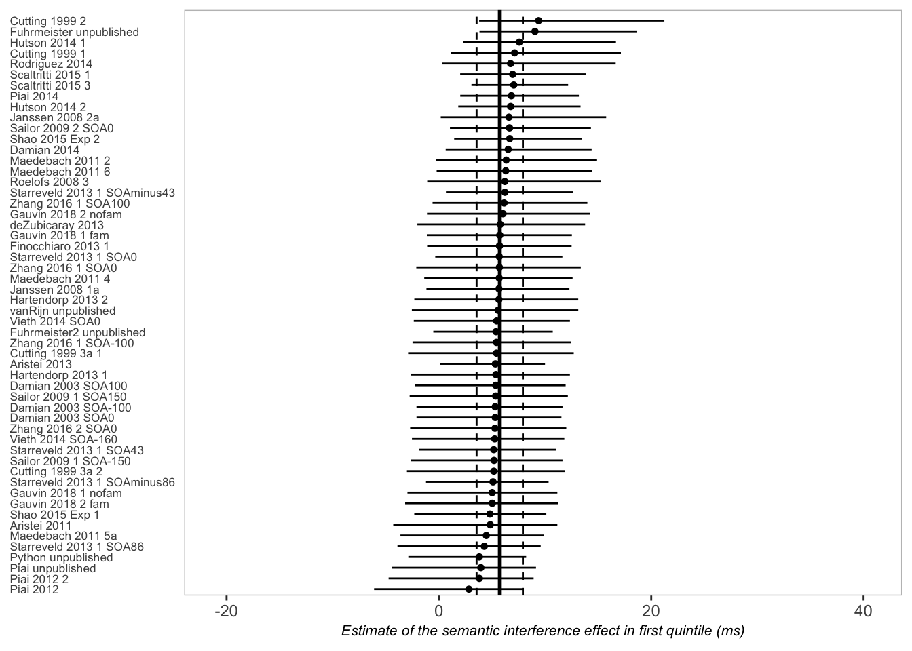
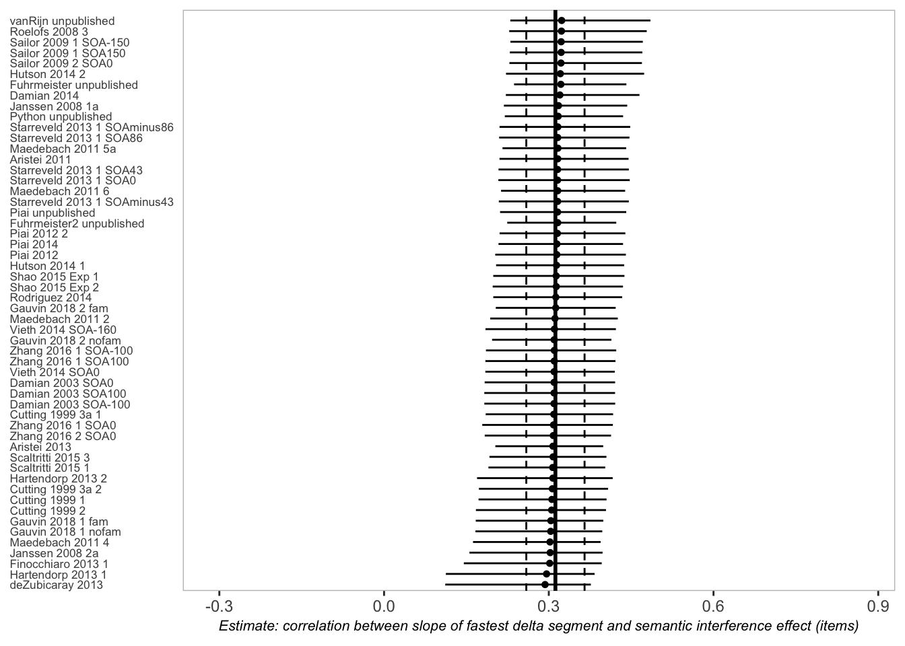

```r
# Uses the computer cores available
options(mc.cores = parallel::detectCores())
options(scipen = 999)
iter <- 20000
chains <- 4
```

# Define priors (main and sensitivity analyses)


```r
d <- read.csv("estimates.slope2.csv")

priors_new <- c(prior(normal(0,100), class = Intercept),
             prior(normal(0,100), class = sd))

priors_sens1 <- c(prior(normal(0,200), class = Intercept),
             prior(normal(0,100), class = sd))

priors_sens2 <- c(prior(uniform(-200,200), class = Intercept),
             prior(normal(0,100), class = sd))

priors_sens3 <- c(prior(normal(0,50), class = Intercept),
             prior(normal(0,100), class = sd))

priors_corr <- c(prior(normal(0,10), class = Intercept),
             prior(normal(0,10), class = sd))

priors_corr_sens1 <- c(prior(uniform(-3,3), class = Intercept),
             prior(normal(0,10), class = sd))

priors_corr_sens2 <- c(prior(uniform(-10,10), class = Intercept),
             prior(normal(0,10), class = sd))
```

# Meta-analysis: semantic interference effect in first quantile


```r
fit_sem_quantile1 <- brm(quantile1|se(`SE_quantile1`) ~1 + (1|Experiment), 
                         data=d,
                         prior= priors_new,
                         control=list(adapt_delta=.999, max_treedepth=12),
                         warmup = 2000, 
                         iter=iter, 
                         save_all_pars = TRUE
                         )
```

```
## Compiling Stan program...
```

```
## Start sampling
```

```r
fit_sem_quantile1
```

```
##  Family: gaussian 
##   Links: mu = identity; sigma = identity 
## Formula: quantile1 | se(SE_quantile1) ~ 1 + (1 | Experiment) 
##    Data: d (Number of observations: 54) 
##   Draws: 4 chains, each with iter = 20000; warmup = 2000; thin = 1;
##          total post-warmup draws = 72000
## 
## Group-Level Effects: 
## ~Experiment (Number of levels: 54) 
##               Estimate Est.Error l-95% CI u-95% CI Rhat Bulk_ESS Tail_ESS
## sd(Intercept)     3.29      1.69     0.25     6.70 1.00    16717    19502
## 
## Population-Level Effects: 
##           Estimate Est.Error l-95% CI u-95% CI Rhat Bulk_ESS Tail_ESS
## Intercept     5.73      1.10     3.57     7.91 1.00    82164    53899
## 
## Family Specific Parameters: 
##       Estimate Est.Error l-95% CI u-95% CI Rhat Bulk_ESS Tail_ESS
## sigma     0.00      0.00     0.00     0.00   NA       NA       NA
## 
## Draws were sampled using sampling(NUTS). For each parameter, Bulk_ESS
## and Tail_ESS are effective sample size measures, and Rhat is the potential
## scale reduction factor on split chains (at convergence, Rhat = 1).
```

```r
tab_model(fit_sem_quantile1,
        show.se=FALSE, show.stat=TRUE, show.ci = 0.95,
       show.re.var=FALSE, show.obs=TRUE,
      emph.p = FALSE , show.icc = FALSE)
```

<table style="border-collapse:collapse; border:none;">
<tr>
<th style="border-top: double; text-align:center; font-style:normal; font-weight:bold; padding:0.2cm;  text-align:left; ">&nbsp;</th>
<th colspan="2" style="border-top: double; text-align:center; font-style:normal; font-weight:bold; padding:0.2cm; ">quantile1 |<br>se(SE_quantile1)</th>
</tr>
<tr>
<td style=" text-align:center; border-bottom:1px solid; font-style:italic; font-weight:normal;  text-align:left; ">Predictors</td>
<td style=" text-align:center; border-bottom:1px solid; font-style:italic; font-weight:normal;  ">Estimates</td>
<td style=" text-align:center; border-bottom:1px solid; font-style:italic; font-weight:normal;  ">CI (95%)</td>
</tr>
<tr>
<td style=" padding:0.2cm; text-align:left; vertical-align:top; text-align:left; ">Intercept</td>
<td style=" padding:0.2cm; text-align:left; vertical-align:top; text-align:center;  ">5.73</td>
<td style=" padding:0.2cm; text-align:left; vertical-align:top; text-align:center;  ">3.57&nbsp;&ndash;&nbsp;7.91</td>
</tr>

<tr>
<td style=" padding:0.2cm; text-align:left; vertical-align:top; text-align:left; padding-top:0.1cm; padding-bottom:0.1cm;">N <sub>Experiment</sub></td>
<td style=" padding:0.2cm; text-align:left; vertical-align:top; padding-top:0.1cm; padding-bottom:0.1cm; text-align:left;" colspan="2">54</td>
<tr>
<td style=" padding:0.2cm; text-align:left; vertical-align:top; text-align:left; padding-top:0.1cm; padding-bottom:0.1cm; border-top:1px solid;">Observations</td>
<td style=" padding:0.2cm; text-align:left; vertical-align:top; padding-top:0.1cm; padding-bottom:0.1cm; text-align:left; border-top:1px solid;" colspan="2">54</td>
</tr>
<tr>
<td style=" padding:0.2cm; text-align:left; vertical-align:top; text-align:left; padding-top:0.1cm; padding-bottom:0.1cm;">Marginal R<sup>2</sup> / Conditional R<sup>2</sup></td>
<td style=" padding:0.2cm; text-align:left; vertical-align:top; padding-top:0.1cm; padding-bottom:0.1cm; text-align:left;" colspan="2">0.000 / 0.077</td>
</tr>

</table>

```r
###############
fit_sem_sens1_quantile1<- brm(quantile1| se(`SE_quantile1`) ~1 + (1|Experiment), 
                              data=d,
                              prior= priors_sens1, 
                              control=list(adapt_delta=.999, max_treedepth=12),
                              warmup = 2000,
                              iter=iter, 
                              save_all_pars = TRUE
                              )
```

```
## Compiling Stan program...
## Start sampling
```

```r
fit_sem_sens1_quantile1
```

```
##  Family: gaussian 
##   Links: mu = identity; sigma = identity 
## Formula: quantile1 | se(SE_quantile1) ~ 1 + (1 | Experiment) 
##    Data: d (Number of observations: 54) 
##   Draws: 4 chains, each with iter = 20000; warmup = 2000; thin = 1;
##          total post-warmup draws = 72000
## 
## Group-Level Effects: 
## ~Experiment (Number of levels: 54) 
##               Estimate Est.Error l-95% CI u-95% CI Rhat Bulk_ESS Tail_ESS
## sd(Intercept)     3.31      1.69     0.25     6.68 1.00    15846    21054
## 
## Population-Level Effects: 
##           Estimate Est.Error l-95% CI u-95% CI Rhat Bulk_ESS Tail_ESS
## Intercept     5.73      1.11     3.57     7.90 1.00    75055    52755
## 
## Family Specific Parameters: 
##       Estimate Est.Error l-95% CI u-95% CI Rhat Bulk_ESS Tail_ESS
## sigma     0.00      0.00     0.00     0.00   NA       NA       NA
## 
## Draws were sampled using sampling(NUTS). For each parameter, Bulk_ESS
## and Tail_ESS are effective sample size measures, and Rhat is the potential
## scale reduction factor on split chains (at convergence, Rhat = 1).
```

```r
###############
fit_sem_sens2_quantile1<- brm(quantile1| se(`SE_quantile1`) ~1 + (1|Experiment), 
                              data=d,
                              prior= priors_sens2,
                              control=list(adapt_delta=.999, max_treedepth=12),
                              warmup = 2000,
                              iter=iter, 
                              save_all_pars = TRUE
                              )
```

```
## Compiling Stan program...
## Start sampling
```

```r
fit_sem_sens2_quantile1
```

```
##  Family: gaussian 
##   Links: mu = identity; sigma = identity 
## Formula: quantile1 | se(SE_quantile1) ~ 1 + (1 | Experiment) 
##    Data: d (Number of observations: 54) 
##   Draws: 4 chains, each with iter = 20000; warmup = 2000; thin = 1;
##          total post-warmup draws = 72000
## 
## Group-Level Effects: 
## ~Experiment (Number of levels: 54) 
##               Estimate Est.Error l-95% CI u-95% CI Rhat Bulk_ESS Tail_ESS
## sd(Intercept)     3.29      1.70     0.25     6.68 1.00    16240    19692
## 
## Population-Level Effects: 
##           Estimate Est.Error l-95% CI u-95% CI Rhat Bulk_ESS Tail_ESS
## Intercept     5.73      1.10     3.57     7.90 1.00    72285    53438
## 
## Family Specific Parameters: 
##       Estimate Est.Error l-95% CI u-95% CI Rhat Bulk_ESS Tail_ESS
## sigma     0.00      0.00     0.00     0.00   NA       NA       NA
## 
## Draws were sampled using sampling(NUTS). For each parameter, Bulk_ESS
## and Tail_ESS are effective sample size measures, and Rhat is the potential
## scale reduction factor on split chains (at convergence, Rhat = 1).
```

```r
###############
fit_sem_sens3_quantile1<- brm(quantile1| se(`SE_quantile1`) ~1 + (1|Experiment), 
                              data=d,
                              prior= priors_sens3,
                              control=list(adapt_delta=.999, max_treedepth=12),
                              warmup = 2000,
                              iter=iter, 
                              save_all_pars = TRUE
                              )
```

```
## Compiling Stan program...
## Start sampling
```

```r
fit_sem_sens3_quantile1
```

```
##  Family: gaussian 
##   Links: mu = identity; sigma = identity 
## Formula: quantile1 | se(SE_quantile1) ~ 1 + (1 | Experiment) 
##    Data: d (Number of observations: 54) 
##   Draws: 4 chains, each with iter = 20000; warmup = 2000; thin = 1;
##          total post-warmup draws = 72000
## 
## Group-Level Effects: 
## ~Experiment (Number of levels: 54) 
##               Estimate Est.Error l-95% CI u-95% CI Rhat Bulk_ESS Tail_ESS
## sd(Intercept)     3.31      1.70     0.27     6.69 1.00    17158    24960
## 
## Population-Level Effects: 
##           Estimate Est.Error l-95% CI u-95% CI Rhat Bulk_ESS Tail_ESS
## Intercept     5.72      1.10     3.58     7.92 1.00    79355    53850
## 
## Family Specific Parameters: 
##       Estimate Est.Error l-95% CI u-95% CI Rhat Bulk_ESS Tail_ESS
## sigma     0.00      0.00     0.00     0.00   NA       NA       NA
## 
## Draws were sampled using sampling(NUTS). For each parameter, Bulk_ESS
## and Tail_ESS are effective sample size measures, and Rhat is the potential
## scale reduction factor on split chains (at convergence, Rhat = 1).
```

```r
fit_sem_quantile1_null <- brm(quantile1|se(`SE_quantile1`) ~ -1 + (1|Experiment), 
                              data=d,
                              prior= prior(normal(0,100), class = sd),
                              control=list(adapt_delta=.999, max_treedepth=12),
                              warmup = 2000,
                              iter=iter, 
                              save_all_pars = TRUE
                              )
```

```
## Compiling Stan program...
## Start sampling
```

```r
# run bridge sampler for all models
fit_sem_quantile1_bs <- bridge_sampler(fit_sem_quantile1, silent = TRUE)
fit_sem_quantile1_null_bs <- bridge_sampler(fit_sem_quantile1_null, silent = TRUE)
fit_sem_sens1_quantile1_bs <- bridge_sampler(fit_sem_sens1_quantile1, silent = TRUE)
fit_sem_sens2_quantile1_bs <- bridge_sampler(fit_sem_sens2_quantile1, silent = TRUE)
fit_sem_sens3_quantile1_bs <- bridge_sampler(fit_sem_sens3_quantile1, silent = TRUE)

# compute Bayes factors 
bf_main_q1 <- round(bayes_factor(fit_sem_quantile1_bs, fit_sem_quantile1_null_bs)$bf,0)
bf_sens1_q1 <- round(bayes_factor(fit_sem_sens1_quantile1_bs, fit_sem_quantile1_null_bs)$bf,0)
bf_sens2_q1 <- round(bayes_factor(fit_sem_sens2_quantile1_bs, fit_sem_quantile1_null_bs)$bf,0)
bf_sens3_q1 <- round(bayes_factor(fit_sem_sens3_quantile1_bs, fit_sem_quantile1_null_bs)$bf,0)

estimates <- fit_sem_quantile1 %>%
  spread_draws(b_Intercept, sd_Experiment__Intercept) %>%
  mean_qi() %>%
  mutate(model = "Quintile 1") %>%
  mutate(BF10 = bf_main_q1)
```


## forest plot


```r
f_q1 <- fit_sem_quantile1 %>%
  spread_draws(b_Intercept, r_Experiment[Experiment,]) %>%
  # add the grand mean to the group-specific deviations
  mutate(mu = b_Intercept + r_Experiment) %>%
  ungroup() %>%
  mutate(Experiment = str_replace_all(Experiment, "[.]", " "))
fp_q1 <- f_q1 %>%
  # plot
  ggplot(aes(x = mu, y = reorder(Experiment, mu))) +
  geom_vline(xintercept = fixef(fit_sem_quantile1)[1, 1], color = "black", size = 1) +
  geom_vline(xintercept = fixef(fit_sem_quantile1)[1, 3:4], color = "black", linetype = 2) +
  stat_halfeye(.width = .95, size = 1/3, fill=transparent("white", trans.val=1)) +
  labs(x = expression(italic("Estimate of the semantic interference effect in first quintile (ms)")),
       y = NULL) +
  #coord_cartesian(xlim = c(-50,80)) +
  # xlim(-120, 120)+
  theme(panel.grid   = element_blank(),
        axis.ticks.y = element_blank(),
        axis.text.y  = element_text(hjust = 0,size = 6.5),
        axis.text.x  = element_text(hjust = 0.5,size = 9),
        axis.title.x =element_text(hjust = 0.5,size = 8),
        panel.background = element_rect(fill="white",color ="grey75"))
fp_q1
```

<!-- -->

```r
# saved at 700x800px
```

## Posterior distribution


```r
color_scheme_set("gray")

sp.sem_q1 <- stanplot(fit_sem_quantile1, pars = c("^b"), type="hist")+
  theme_bw()+
  facet_text(on = FALSE)+
  #theme(text = element_text(size=10), axis.text.x =element_text(c("xx","yy")), legend.text=element_text(size=10))+
  coord_cartesian(xlim = c(0,75), ylim = c(0,10000)) +
  ylab("Density")+
  xlab("")+
  ggtitle("Quintile 1")
```

# Table for sensitivity analysis quantile 1


```r
sens_q1 <- fit_sem_sens1_quantile1 %>%
  spread_draws(b_Intercept, sd_Experiment__Intercept) %>%
  mean_qi() %>%
  mutate(model = paste(priors_sens1[1,1])) %>%
  mutate(BF10 = bf_sens1_q1)

sens2_q1 <- fit_sem_sens2_quantile1 %>%
  spread_draws(b_Intercept, sd_Experiment__Intercept) %>%
  mean_qi() %>%
  mutate(model = paste(priors_sens2[1,1])) %>%
  mutate(BF10 = bf_sens2_q1)

sens3_q1 <- fit_sem_sens3_quantile1 %>%
  spread_draws(b_Intercept, sd_Experiment__Intercept) %>%
  mean_qi() %>%
  mutate(model = paste(priors_sens3[1,1])) %>%
  mutate(BF10 = bf_sens3_q1)

sens_q1 <- rbind(sens_q1, sens2_q1, sens3_q1)

sens_q1 <- sens_q1[,c(1:6,10:11)]
sens_q1 <- sens_q1[,c(7,1:6,8)]

sens_q1[2:7] <- lapply(sens_q1[2:7], function(x) round(x, 0))

sens_q1$`95% CrI` <- paste0("[",sens_q1$b_Intercept.lower,",",sens_q1$b_Intercept.upper,"]")

sens_q1 <- sens_q1 %>%
  select(-c(b_Intercept.lower,b_Intercept.upper))
sens_q1 <- sens_q1[,c(1:2,7,3:6)]

sens_q1$`tau 95% CrI` <- paste0("[",sens_q1$sd_Experiment__Intercept.lower,",",sens_q1$sd_Experiment__Intercept.upper,"]")

sens_q1 <- sens_q1 %>%
  select(-c(sd_Experiment__Intercept.lower,sd_Experiment__Intercept.upper))
sens_q1 <- sens_q1[,c(1:4,6,5)]

colnames(sens_q1) <- c("Prior", "Estimate in ms", "95% CrI", "tau", "95% CrI", "BF10")

sens_q1 %>%
  kbl() %>%
  kable_styling()
```

<table class="table" style="margin-left: auto; margin-right: auto;">
 <thead>
  <tr>
   <th style="text-align:left;"> Prior </th>
   <th style="text-align:right;"> Estimate in ms </th>
   <th style="text-align:left;"> 95% CrI </th>
   <th style="text-align:right;"> tau </th>
   <th style="text-align:left;"> 95% CrI </th>
   <th style="text-align:right;"> BF10 </th>
  </tr>
 </thead>
<tbody>
  <tr>
   <td style="text-align:left;"> normal(0, 200) </td>
   <td style="text-align:right;"> 6 </td>
   <td style="text-align:left;"> [4,8] </td>
   <td style="text-align:right;"> 3 </td>
   <td style="text-align:left;"> [0,7] </td>
   <td style="text-align:right;"> 295 </td>
  </tr>
  <tr>
   <td style="text-align:left;"> uniform(-200, 200) </td>
   <td style="text-align:right;"> 6 </td>
   <td style="text-align:left;"> [4,8] </td>
   <td style="text-align:right;"> 3 </td>
   <td style="text-align:left;"> [0,7] </td>
   <td style="text-align:right;"> 366 </td>
  </tr>
  <tr>
   <td style="text-align:left;"> normal(0, 50) </td>
   <td style="text-align:right;"> 6 </td>
   <td style="text-align:left;"> [4,8] </td>
   <td style="text-align:right;"> 3 </td>
   <td style="text-align:left;"> [0,7] </td>
   <td style="text-align:right;"> 1170 </td>
  </tr>
</tbody>
</table>


# Meta-analysis: semantic interference effect in second quantile


```r
fit_sem_quantile2 <- brm(quantile2|se(`SE_quantile2`) ~1 + (1|Experiment), 
                         data=d,
                         prior= priors_new,
                         control=list(adapt_delta=.999, max_treedepth=12),
                         warmup = 2000, 
                         iter=iter, 
                         save_all_pars = TRUE
                         )
```

```
## Compiling Stan program...
```

```
## Start sampling
```

```r
fit_sem_quantile2
```

```
##  Family: gaussian 
##   Links: mu = identity; sigma = identity 
## Formula: quantile2 | se(SE_quantile2) ~ 1 + (1 | Experiment) 
##    Data: d (Number of observations: 54) 
##   Draws: 4 chains, each with iter = 20000; warmup = 2000; thin = 1;
##          total post-warmup draws = 72000
## 
## Group-Level Effects: 
## ~Experiment (Number of levels: 54) 
##               Estimate Est.Error l-95% CI u-95% CI Rhat Bulk_ESS Tail_ESS
## sd(Intercept)     6.06      1.60     2.96     9.31 1.00    25829    23320
## 
## Population-Level Effects: 
##           Estimate Est.Error l-95% CI u-95% CI Rhat Bulk_ESS Tail_ESS
## Intercept    10.91      1.39     8.20    13.68 1.00    49073    51216
## 
## Family Specific Parameters: 
##       Estimate Est.Error l-95% CI u-95% CI Rhat Bulk_ESS Tail_ESS
## sigma     0.00      0.00     0.00     0.00   NA       NA       NA
## 
## Draws were sampled using sampling(NUTS). For each parameter, Bulk_ESS
## and Tail_ESS are effective sample size measures, and Rhat is the potential
## scale reduction factor on split chains (at convergence, Rhat = 1).
```

```r
tab_model(fit_sem_quantile2,
        show.se=FALSE, show.stat=TRUE, show.ci = 0.95,
       show.re.var=FALSE, show.obs=TRUE,
      emph.p = FALSE , show.icc = FALSE)
```

<table style="border-collapse:collapse; border:none;">
<tr>
<th style="border-top: double; text-align:center; font-style:normal; font-weight:bold; padding:0.2cm;  text-align:left; ">&nbsp;</th>
<th colspan="2" style="border-top: double; text-align:center; font-style:normal; font-weight:bold; padding:0.2cm; ">quantile2 |<br>se(SE_quantile2)</th>
</tr>
<tr>
<td style=" text-align:center; border-bottom:1px solid; font-style:italic; font-weight:normal;  text-align:left; ">Predictors</td>
<td style=" text-align:center; border-bottom:1px solid; font-style:italic; font-weight:normal;  ">Estimates</td>
<td style=" text-align:center; border-bottom:1px solid; font-style:italic; font-weight:normal;  ">CI (95%)</td>
</tr>
<tr>
<td style=" padding:0.2cm; text-align:left; vertical-align:top; text-align:left; ">Intercept</td>
<td style=" padding:0.2cm; text-align:left; vertical-align:top; text-align:center;  ">10.90</td>
<td style=" padding:0.2cm; text-align:left; vertical-align:top; text-align:center;  ">8.20&nbsp;&ndash;&nbsp;13.68</td>
</tr>

<tr>
<td style=" padding:0.2cm; text-align:left; vertical-align:top; text-align:left; padding-top:0.1cm; padding-bottom:0.1cm;">N <sub>Experiment</sub></td>
<td style=" padding:0.2cm; text-align:left; vertical-align:top; padding-top:0.1cm; padding-bottom:0.1cm; text-align:left;" colspan="2">54</td>
<tr>
<td style=" padding:0.2cm; text-align:left; vertical-align:top; text-align:left; padding-top:0.1cm; padding-bottom:0.1cm; border-top:1px solid;">Observations</td>
<td style=" padding:0.2cm; text-align:left; vertical-align:top; padding-top:0.1cm; padding-bottom:0.1cm; text-align:left; border-top:1px solid;" colspan="2">54</td>
</tr>
<tr>
<td style=" padding:0.2cm; text-align:left; vertical-align:top; text-align:left; padding-top:0.1cm; padding-bottom:0.1cm;">Marginal R<sup>2</sup> / Conditional R<sup>2</sup></td>
<td style=" padding:0.2cm; text-align:left; vertical-align:top; padding-top:0.1cm; padding-bottom:0.1cm; text-align:left;" colspan="2">0.000 / 0.205</td>
</tr>

</table>

```r
###############
fit_sem_sens1_quantile2<- brm(quantile2| se(`SE_quantile2`) ~1 + (1|Experiment), 
                              data=d,
                              prior= priors_sens1,
                              control=list(adapt_delta=.999, max_treedepth=12),
                              warmup = 2000, 
                              iter=iter, 
                              save_all_pars = TRUE
                              )
```

```
## Compiling Stan program...
## Start sampling
```

```r
fit_sem_sens1_quantile2
```

```
##  Family: gaussian 
##   Links: mu = identity; sigma = identity 
## Formula: quantile2 | se(SE_quantile2) ~ 1 + (1 | Experiment) 
##    Data: d (Number of observations: 54) 
##   Draws: 4 chains, each with iter = 20000; warmup = 2000; thin = 1;
##          total post-warmup draws = 72000
## 
## Group-Level Effects: 
## ~Experiment (Number of levels: 54) 
##               Estimate Est.Error l-95% CI u-95% CI Rhat Bulk_ESS Tail_ESS
## sd(Intercept)     6.06      1.60     2.96     9.28 1.00    20873    17897
## 
## Population-Level Effects: 
##           Estimate Est.Error l-95% CI u-95% CI Rhat Bulk_ESS Tail_ESS
## Intercept    10.90      1.40     8.18    13.69 1.00    38306    44599
## 
## Family Specific Parameters: 
##       Estimate Est.Error l-95% CI u-95% CI Rhat Bulk_ESS Tail_ESS
## sigma     0.00      0.00     0.00     0.00   NA       NA       NA
## 
## Draws were sampled using sampling(NUTS). For each parameter, Bulk_ESS
## and Tail_ESS are effective sample size measures, and Rhat is the potential
## scale reduction factor on split chains (at convergence, Rhat = 1).
```

```r
###############
fit_sem_sens2_quantile2<- brm(quantile2| se(`SE_quantile2`) ~1 + (1|Experiment), 
                              data=d,
                              prior= priors_sens2,
                              control=list(adapt_delta=.999, max_treedepth=12),
                              warmup = 2000, 
                              iter=iter, 
                              save_all_pars = TRUE
                              )
```

```
## Compiling Stan program...
## Start sampling
```

```r
fit_sem_sens2_quantile2
```

```
##  Family: gaussian 
##   Links: mu = identity; sigma = identity 
## Formula: quantile2 | se(SE_quantile2) ~ 1 + (1 | Experiment) 
##    Data: d (Number of observations: 54) 
##   Draws: 4 chains, each with iter = 20000; warmup = 2000; thin = 1;
##          total post-warmup draws = 72000
## 
## Group-Level Effects: 
## ~Experiment (Number of levels: 54) 
##               Estimate Est.Error l-95% CI u-95% CI Rhat Bulk_ESS Tail_ESS
## sd(Intercept)     6.07      1.57     3.03     9.24 1.00    26377    26372
## 
## Population-Level Effects: 
##           Estimate Est.Error l-95% CI u-95% CI Rhat Bulk_ESS Tail_ESS
## Intercept    10.91      1.40     8.19    13.68 1.00    49323    53608
## 
## Family Specific Parameters: 
##       Estimate Est.Error l-95% CI u-95% CI Rhat Bulk_ESS Tail_ESS
## sigma     0.00      0.00     0.00     0.00   NA       NA       NA
## 
## Draws were sampled using sampling(NUTS). For each parameter, Bulk_ESS
## and Tail_ESS are effective sample size measures, and Rhat is the potential
## scale reduction factor on split chains (at convergence, Rhat = 1).
```

```r
###############
fit_sem_sens3_quantile2<- brm(quantile2| se(`SE_quantile2`) ~1 + (1|Experiment), 
                              data=d,
                              prior= priors_sens3,
                              control=list(adapt_delta=.999, max_treedepth=12),
                              warmup = 2000,
                              iter=iter, 
                              save_all_pars = TRUE
                              )
```

```
## Compiling Stan program...
## Start sampling
```

```r
fit_sem_sens3_quantile2
```

```
##  Family: gaussian 
##   Links: mu = identity; sigma = identity 
## Formula: quantile2 | se(SE_quantile2) ~ 1 + (1 | Experiment) 
##    Data: d (Number of observations: 54) 
##   Draws: 4 chains, each with iter = 20000; warmup = 2000; thin = 1;
##          total post-warmup draws = 72000
## 
## Group-Level Effects: 
## ~Experiment (Number of levels: 54) 
##               Estimate Est.Error l-95% CI u-95% CI Rhat Bulk_ESS Tail_ESS
## sd(Intercept)     6.07      1.59     2.99     9.31 1.00    25020    25814
## 
## Population-Level Effects: 
##           Estimate Est.Error l-95% CI u-95% CI Rhat Bulk_ESS Tail_ESS
## Intercept    10.91      1.39     8.19    13.67 1.00    51111    53879
## 
## Family Specific Parameters: 
##       Estimate Est.Error l-95% CI u-95% CI Rhat Bulk_ESS Tail_ESS
## sigma     0.00      0.00     0.00     0.00   NA       NA       NA
## 
## Draws were sampled using sampling(NUTS). For each parameter, Bulk_ESS
## and Tail_ESS are effective sample size measures, and Rhat is the potential
## scale reduction factor on split chains (at convergence, Rhat = 1).
```

```r
###############
fit_sem_quantile2_null <- brm(quantile2|se(`SE_quantile2`) ~ -1 + (1|Experiment), 
                              data=d,
                              prior= prior(normal(0,100), class = sd),
                              control=list(adapt_delta=.999, max_treedepth=12),
                              warmup = 2000, 
                              iter=iter, 
                              save_all_pars = TRUE
                              )
```

```
## Compiling Stan program...
## Start sampling
```

```r
fit_sem_quantile2_bs <- bridge_sampler(fit_sem_quantile2, silent = TRUE)
fit_sem_quantile2_null_bs <- bridge_sampler(fit_sem_quantile2_null, silent = TRUE)
fit_sem_sens1_quantile2_bs <- bridge_sampler(fit_sem_sens1_quantile2, silent = TRUE)
fit_sem_sens2_quantile2_bs <- bridge_sampler(fit_sem_sens2_quantile2, silent = TRUE)
fit_sem_sens3_quantile2_bs <- bridge_sampler(fit_sem_sens3_quantile2, silent = TRUE)

bf_main_q2 <- round(bayes_factor(fit_sem_quantile2_bs, fit_sem_quantile2_null_bs)$bf,0)
bf_sens1_q2 <- round(bayes_factor(fit_sem_sens1_quantile2_bs, fit_sem_quantile2_null_bs)$bf,0)
bf_sens2_q2 <- round(bayes_factor(fit_sem_sens2_quantile2_bs, fit_sem_quantile2_null_bs)$bf,0)
bf_sens3_q2 <- round(bayes_factor(fit_sem_sens3_quantile2_bs, fit_sem_quantile2_null_bs)$bf,0)

estimates_q2 <- fit_sem_quantile2 %>%
  spread_draws(b_Intercept, sd_Experiment__Intercept) %>%
  mean_qi() %>%
  mutate(model = "Quintile 2") %>%
  mutate(BF10 = bf_main_q2)

estimates <- rbind(estimates, estimates_q2)
```

## forest plot


```r
f_q2 <- fit_sem_quantile2 %>%
  spread_draws(b_Intercept, r_Experiment[Experiment,]) %>%
  # add the grand mean to the group-specific deviations
  mutate(mu = b_Intercept + r_Experiment) %>%
  ungroup() %>%
  mutate(Experiment = str_replace_all(Experiment, "[.]", " "))
fp_q2 <- f_q2 %>%
  # plot
  ggplot(aes(x = mu, y = reorder(Experiment, mu))) +
  geom_vline(xintercept = fixef(fit_sem_quantile2)[1, 1], color = "black", size = 1) +
  geom_vline(xintercept = fixef(fit_sem_quantile2)[1, 3:4], color = "black", linetype = 2) +
  stat_halfeye(.width = .95, size = 1/3, fill=transparent("white", trans.val=1)) +
  labs(x = expression(italic("Estimate of the semantic interference effect in second quintile (ms)")),
       y = NULL) +
  #coord_cartesian(xlim = c(-50,80)) +
  # xlim(-120, 120)+
  theme(panel.grid   = element_blank(),
        axis.ticks.y = element_blank(),
        axis.text.y  = element_text(hjust = 0,size = 6.5),
        axis.text.x  = element_text(hjust = 0.5,size = 9),
        axis.title.x =element_text(hjust = 0.5,size = 8),
        panel.background = element_rect(fill="white",color ="grey75"))
fp_q2
```

<!-- -->

```r
# saved at 700x800px
```

## Posterior distribution


```r
color_scheme_set("gray")

sp.sem_q2 <- stanplot(fit_sem_quantile2, pars = c("^b"), type="hist")+
  theme_bw()+
  facet_text(on = FALSE)+
  #theme(text = element_text(size=10), axis.text.x =element_text(c("xx","yy")), legend.text=element_text(size=10))+
  coord_cartesian(xlim = c(0,75), ylim = c(0,10000)) +
  #ylab("Density")+
  xlab("")+
  ggtitle("Quintile 2")
```

# Table for sensitivity analysis quantile 2


```r
sens_q2 <- fit_sem_sens1_quantile2 %>%
  spread_draws(b_Intercept, sd_Experiment__Intercept) %>%
  mean_qi() %>%
  mutate(model = paste(priors_sens1[1,1])) %>%
  mutate(BF10 = bf_sens1_q2)

sens2_q2 <- fit_sem_sens2_quantile2 %>%
  spread_draws(b_Intercept, sd_Experiment__Intercept) %>%
  mean_qi() %>%
  mutate(model = paste(priors_sens2[1,1])) %>%
  mutate(BF10 = bf_sens2_q2)

sens3_q2 <- fit_sem_sens3_quantile2 %>%
  spread_draws(b_Intercept, sd_Experiment__Intercept) %>%
  mean_qi() %>%
  mutate(model = paste(priors_sens3[1,1])) %>%
  mutate(BF10 = bf_sens3_q2)

sens_q2 <- rbind(sens_q2, sens2_q2, sens3_q2)

sens_q2 <- sens_q2[,c(1:6,10:11)]
sens_q2 <- sens_q2[,c(7,1:6,8)]

sens_q2[2:7] <- lapply(sens_q2[2:7], function(x) round(x, 0))

sens_q2$`95% CrI` <- paste0("[",sens_q2$b_Intercept.lower,",",sens_q2$b_Intercept.upper,"]")

sens_q2 <- sens_q2 %>%
  select(-c(b_Intercept.lower,b_Intercept.upper))
sens_q2 <- sens_q2[,c(1:2,7,3:6)]

sens_q2$`tau 95% CrI` <- paste0("[",sens_q2$sd_Experiment__Intercept.lower,",",sens_q2$sd_Experiment__Intercept.upper,"]")

sens_q2 <- sens_q2 %>%
  select(-c(sd_Experiment__Intercept.lower,sd_Experiment__Intercept.upper))
sens_q2 <- sens_q2[,c(1:4,6,5)]

colnames(sens_q2) <- c("Prior", "Estimate in ms", "95% CrI", "tau", "95% CrI", "BF10")

sens_q2 %>%
  kbl() %>%
  kable_styling()
```

<table class="table" style="margin-left: auto; margin-right: auto;">
 <thead>
  <tr>
   <th style="text-align:left;"> Prior </th>
   <th style="text-align:right;"> Estimate in ms </th>
   <th style="text-align:left;"> 95% CrI </th>
   <th style="text-align:right;"> tau </th>
   <th style="text-align:left;"> 95% CrI </th>
   <th style="text-align:right;"> BF10 </th>
  </tr>
 </thead>
<tbody>
  <tr>
   <td style="text-align:left;"> normal(0, 200) </td>
   <td style="text-align:right;"> 11 </td>
   <td style="text-align:left;"> [8,14] </td>
   <td style="text-align:right;"> 6 </td>
   <td style="text-align:left;"> [3,9] </td>
   <td style="text-align:right;"> 11346505 </td>
  </tr>
  <tr>
   <td style="text-align:left;"> uniform(-200, 200) </td>
   <td style="text-align:right;"> 11 </td>
   <td style="text-align:left;"> [8,14] </td>
   <td style="text-align:right;"> 6 </td>
   <td style="text-align:left;"> [3,9] </td>
   <td style="text-align:right;"> 14242694 </td>
  </tr>
  <tr>
   <td style="text-align:left;"> normal(0, 50) </td>
   <td style="text-align:right;"> 11 </td>
   <td style="text-align:left;"> [8,14] </td>
   <td style="text-align:right;"> 6 </td>
   <td style="text-align:left;"> [3,9] </td>
   <td style="text-align:right;"> 44326968 </td>
  </tr>
</tbody>
</table>

# Meta-analysis: semantic interference effect in third quantile


```r
fit_sem_quantile3 <- brm(quantile3|se(`SE_quantile3`) ~1 + (1|Experiment), 
                         data=d,
                         prior= priors_new,
                         control=list(adapt_delta=.999, max_treedepth=12),
                         warmup = 2000,
                         iter=iter, 
                         save_all_pars = TRUE
                         )
```

```
## Compiling Stan program...
```

```
## Start sampling
```

```r
fit_sem_quantile3
```

```
##  Family: gaussian 
##   Links: mu = identity; sigma = identity 
## Formula: quantile3 | se(SE_quantile3) ~ 1 + (1 | Experiment) 
##    Data: d (Number of observations: 54) 
##   Draws: 4 chains, each with iter = 20000; warmup = 2000; thin = 1;
##          total post-warmup draws = 72000
## 
## Group-Level Effects: 
## ~Experiment (Number of levels: 54) 
##               Estimate Est.Error l-95% CI u-95% CI Rhat Bulk_ESS Tail_ESS
## sd(Intercept)    10.24      1.90     6.82    14.29 1.00    26333    43054
## 
## Population-Level Effects: 
##           Estimate Est.Error l-95% CI u-95% CI Rhat Bulk_ESS Tail_ESS
## Intercept    17.11      1.95    13.33    20.98 1.00    29118    42693
## 
## Family Specific Parameters: 
##       Estimate Est.Error l-95% CI u-95% CI Rhat Bulk_ESS Tail_ESS
## sigma     0.00      0.00     0.00     0.00   NA       NA       NA
## 
## Draws were sampled using sampling(NUTS). For each parameter, Bulk_ESS
## and Tail_ESS are effective sample size measures, and Rhat is the potential
## scale reduction factor on split chains (at convergence, Rhat = 1).
```

```r
tab_model(fit_sem_quantile3,
        show.se=FALSE, show.stat=TRUE, show.ci = 0.95,
       show.re.var=FALSE, show.obs=TRUE,
      emph.p = FALSE , show.icc = FALSE)
```

<table style="border-collapse:collapse; border:none;">
<tr>
<th style="border-top: double; text-align:center; font-style:normal; font-weight:bold; padding:0.2cm;  text-align:left; ">&nbsp;</th>
<th colspan="2" style="border-top: double; text-align:center; font-style:normal; font-weight:bold; padding:0.2cm; ">quantile3 |<br>se(SE_quantile3)</th>
</tr>
<tr>
<td style=" text-align:center; border-bottom:1px solid; font-style:italic; font-weight:normal;  text-align:left; ">Predictors</td>
<td style=" text-align:center; border-bottom:1px solid; font-style:italic; font-weight:normal;  ">Estimates</td>
<td style=" text-align:center; border-bottom:1px solid; font-style:italic; font-weight:normal;  ">CI (95%)</td>
</tr>
<tr>
<td style=" padding:0.2cm; text-align:left; vertical-align:top; text-align:left; ">Intercept</td>
<td style=" padding:0.2cm; text-align:left; vertical-align:top; text-align:center;  ">17.10</td>
<td style=" padding:0.2cm; text-align:left; vertical-align:top; text-align:center;  ">13.33&nbsp;&ndash;&nbsp;20.98</td>
</tr>

<tr>
<td style=" padding:0.2cm; text-align:left; vertical-align:top; text-align:left; padding-top:0.1cm; padding-bottom:0.1cm;">N <sub>Experiment</sub></td>
<td style=" padding:0.2cm; text-align:left; vertical-align:top; padding-top:0.1cm; padding-bottom:0.1cm; text-align:left;" colspan="2">54</td>
<tr>
<td style=" padding:0.2cm; text-align:left; vertical-align:top; text-align:left; padding-top:0.1cm; padding-bottom:0.1cm; border-top:1px solid;">Observations</td>
<td style=" padding:0.2cm; text-align:left; vertical-align:top; padding-top:0.1cm; padding-bottom:0.1cm; text-align:left; border-top:1px solid;" colspan="2">54</td>
</tr>
<tr>
<td style=" padding:0.2cm; text-align:left; vertical-align:top; text-align:left; padding-top:0.1cm; padding-bottom:0.1cm;">Marginal R<sup>2</sup> / Conditional R<sup>2</sup></td>
<td style=" padding:0.2cm; text-align:left; vertical-align:top; padding-top:0.1cm; padding-bottom:0.1cm; text-align:left;" colspan="2">0.000 / 0.344</td>
</tr>

</table>

```r
###############
fit_sem_sens1_quantile3<- brm(quantile3| se(`SE_quantile3`) ~1 + (1|Experiment), 
                              data=d,
                              prior= priors_sens1,
                              control=list(adapt_delta=.999, max_treedepth=12),
                              warmup = 2000,
                              iter=iter, 
                              save_all_pars = TRUE
                              )
```

```
## Compiling Stan program...
## Start sampling
```

```r
fit_sem_sens1_quantile3
```

```
##  Family: gaussian 
##   Links: mu = identity; sigma = identity 
## Formula: quantile3 | se(SE_quantile3) ~ 1 + (1 | Experiment) 
##    Data: d (Number of observations: 54) 
##   Draws: 4 chains, each with iter = 20000; warmup = 2000; thin = 1;
##          total post-warmup draws = 72000
## 
## Group-Level Effects: 
## ~Experiment (Number of levels: 54) 
##               Estimate Est.Error l-95% CI u-95% CI Rhat Bulk_ESS Tail_ESS
## sd(Intercept)    10.24      1.90     6.85    14.28 1.00    28835    45574
## 
## Population-Level Effects: 
##           Estimate Est.Error l-95% CI u-95% CI Rhat Bulk_ESS Tail_ESS
## Intercept    17.13      1.94    13.36    21.00 1.00    33704    48360
## 
## Family Specific Parameters: 
##       Estimate Est.Error l-95% CI u-95% CI Rhat Bulk_ESS Tail_ESS
## sigma     0.00      0.00     0.00     0.00   NA       NA       NA
## 
## Draws were sampled using sampling(NUTS). For each parameter, Bulk_ESS
## and Tail_ESS are effective sample size measures, and Rhat is the potential
## scale reduction factor on split chains (at convergence, Rhat = 1).
```

```r
###############
fit_sem_sens2_quantile3<- brm(quantile3| se(`SE_quantile3`) ~1 + (1|Experiment), 
                              data=d,
                              prior= priors_sens2,
                              control=list(adapt_delta=.999, max_treedepth=12),
                              warmup = 2000,
                              iter=iter, 
                              save_all_pars = TRUE
                              )
```

```
## Compiling Stan program...
## Start sampling
```

```r
fit_sem_sens2_quantile3
```

```
##  Family: gaussian 
##   Links: mu = identity; sigma = identity 
## Formula: quantile3 | se(SE_quantile3) ~ 1 + (1 | Experiment) 
##    Data: d (Number of observations: 54) 
##   Draws: 4 chains, each with iter = 20000; warmup = 2000; thin = 1;
##          total post-warmup draws = 72000
## 
## Group-Level Effects: 
## ~Experiment (Number of levels: 54) 
##               Estimate Est.Error l-95% CI u-95% CI Rhat Bulk_ESS Tail_ESS
## sd(Intercept)    10.22      1.89     6.82    14.26 1.00    28849    40530
## 
## Population-Level Effects: 
##           Estimate Est.Error l-95% CI u-95% CI Rhat Bulk_ESS Tail_ESS
## Intercept    17.10      1.96    13.28    21.01 1.00    32265    44793
## 
## Family Specific Parameters: 
##       Estimate Est.Error l-95% CI u-95% CI Rhat Bulk_ESS Tail_ESS
## sigma     0.00      0.00     0.00     0.00   NA       NA       NA
## 
## Draws were sampled using sampling(NUTS). For each parameter, Bulk_ESS
## and Tail_ESS are effective sample size measures, and Rhat is the potential
## scale reduction factor on split chains (at convergence, Rhat = 1).
```

```r
###############
fit_sem_sens3_quantile3<- brm(quantile3| se(`SE_quantile3`) ~1 + (1|Experiment), 
                              data=d,
                              prior= priors_sens3,
                              control=list(adapt_delta=.999, max_treedepth=12),
                              warmup = 2000, 
                              iter=iter, 
                              save_all_pars = TRUE
                              )
```

```
## Compiling Stan program...
## Start sampling
```

```r
fit_sem_sens3_quantile3
```

```
##  Family: gaussian 
##   Links: mu = identity; sigma = identity 
## Formula: quantile3 | se(SE_quantile3) ~ 1 + (1 | Experiment) 
##    Data: d (Number of observations: 54) 
##   Draws: 4 chains, each with iter = 20000; warmup = 2000; thin = 1;
##          total post-warmup draws = 72000
## 
## Group-Level Effects: 
## ~Experiment (Number of levels: 54) 
##               Estimate Est.Error l-95% CI u-95% CI Rhat Bulk_ESS Tail_ESS
## sd(Intercept)    10.23      1.90     6.83    14.30 1.00    28441    42812
## 
## Population-Level Effects: 
##           Estimate Est.Error l-95% CI u-95% CI Rhat Bulk_ESS Tail_ESS
## Intercept    17.09      1.95    13.29    20.96 1.00    33260    44347
## 
## Family Specific Parameters: 
##       Estimate Est.Error l-95% CI u-95% CI Rhat Bulk_ESS Tail_ESS
## sigma     0.00      0.00     0.00     0.00   NA       NA       NA
## 
## Draws were sampled using sampling(NUTS). For each parameter, Bulk_ESS
## and Tail_ESS are effective sample size measures, and Rhat is the potential
## scale reduction factor on split chains (at convergence, Rhat = 1).
```

```r
###############
fit_sem_quantile3_null <- brm(quantile3|se(`SE_quantile3`) ~ -1 + (1|Experiment), 
                              data=d,
                              prior= prior(normal(0,100), class = sd),
                              control=list(adapt_delta=.999, max_treedepth=12),
                              warmup = 2000,
                              iter=iter, 
                              save_all_pars = TRUE
                              )
```

```
## Compiling Stan program...
## Start sampling
```

```r
fit_sem_quantile3_bs <- bridge_sampler(fit_sem_quantile3, silent = TRUE)
fit_sem_quantile3_null_bs <- bridge_sampler(fit_sem_quantile3_null, silent = TRUE)
fit_sem_sens1_quantile3_bs <- bridge_sampler(fit_sem_sens1_quantile3, silent = TRUE)
fit_sem_sens2_quantile3_bs <- bridge_sampler(fit_sem_sens2_quantile3, silent = TRUE)
fit_sem_sens3_quantile3_bs <- bridge_sampler(fit_sem_sens3_quantile3, silent = TRUE)

bf_main_q3 <- round(bayes_factor(fit_sem_quantile3_bs, fit_sem_quantile3_null_bs)$bf,0)
bf_sens1_q3 <- round(bayes_factor(fit_sem_sens1_quantile3_bs, fit_sem_quantile3_null_bs)$bf,0)
bf_sens2_q3 <- round(bayes_factor(fit_sem_sens2_quantile3_bs, fit_sem_quantile3_null_bs)$bf,0)
bf_sens3_q3 <- round(bayes_factor(fit_sem_sens3_quantile3_bs, fit_sem_quantile3_null_bs)$bf,0)


estimates_q3 <- fit_sem_quantile3 %>%
  spread_draws(b_Intercept, sd_Experiment__Intercept) %>%
  mean_qi() %>%
  mutate(model = "Quintile 3") %>%
  mutate(BF10 = bf_main_q3)

estimates <- rbind(estimates, estimates_q3)
```

## forest plot


```r
f_q3 <- fit_sem_quantile3 %>%
  spread_draws(b_Intercept, r_Experiment[Experiment,]) %>%
  # add the grand mean to the group-specific deviations
  mutate(mu = b_Intercept + r_Experiment) %>%
  ungroup() %>%
  mutate(Experiment = str_replace_all(Experiment, "[.]", " "))
fp_q3 <- f_q3 %>%
  # plot
  ggplot(aes(x = mu, y = reorder(Experiment, mu))) +
  geom_vline(xintercept = fixef(fit_sem_quantile3)[1, 1], color = "black", size = 1) +
  geom_vline(xintercept = fixef(fit_sem_quantile3)[1, 3:4], color = "black", linetype = 2) +
  stat_halfeye(.width = .95, size = 1/3, fill=transparent("white", trans.val=1)) +
  labs(x = expression(italic("Estimate of the semantic interference effect in third quintile (ms)")),
       y = NULL) +
  #coord_cartesian(xlim = c(-50,80)) +
  # xlim(-120, 120)+
  theme(panel.grid   = element_blank(),
        axis.ticks.y = element_blank(),
        axis.text.y  = element_text(hjust = 0,size = 6.5),
        axis.text.x  = element_text(hjust = 0.5,size = 9),
        axis.title.x =element_text(hjust = 0.5,size = 8),
        panel.background = element_rect(fill="white",color ="grey75"))
fp_q3
```

<!-- -->

```r
# saved at 700x800px
```

## Posterior distribution


```r
color_scheme_set("gray")

sp.sem_q3 <- stanplot(fit_sem_quantile3, pars = c("^b"), type="hist")+
  theme_bw()+
  facet_text(on = FALSE)+
  #theme(text = element_text(size=10), axis.text.x =element_text(c("xx","yy")), legend.text=element_text(size=10))+
  coord_cartesian(xlim = c(0,75), ylim = c(0,10000)) +
  #ylab("Density")+
  xlab("")+
  ggtitle("Quintile 3")
```

# Table for sensitivity analysis quantile 3


```r
sens_q3 <- fit_sem_sens1_quantile3 %>%
  spread_draws(b_Intercept, sd_Experiment__Intercept) %>%
  mean_qi() %>%
  mutate(model = paste(priors_sens1[1,1])) %>%
  mutate(BF10 = bf_sens1_q3)

sens2_q3 <- fit_sem_sens2_quantile3 %>%
  spread_draws(b_Intercept, sd_Experiment__Intercept) %>%
  mean_qi() %>%
  mutate(model = paste(priors_sens2[1,1])) %>%
  mutate(BF10 = bf_sens2_q3)

sens3_q3 <- fit_sem_sens3_quantile3 %>%
  spread_draws(b_Intercept, sd_Experiment__Intercept) %>%
  mean_qi() %>%
  mutate(model = paste(priors_sens3[1,1])) %>%
  mutate(BF10 = bf_sens3_q3)

sens_q3 <- rbind(sens_q3, sens2_q3, sens3_q3)

sens_q3 <- sens_q3[,c(1:6,10:11)]
sens_q3 <- sens_q3[,c(7,1:6,8)]

sens_q3[2:7] <- lapply(sens_q3[2:7], function(x) round(x, 0))

sens_q3$`95% CrI` <- paste0("[",sens_q3$b_Intercept.lower,",",sens_q3$b_Intercept.upper,"]")

sens_q3 <- sens_q3 %>%
  select(-c(b_Intercept.lower,b_Intercept.upper))
sens_q3 <- sens_q3[,c(1:2,7,3:6)]

sens_q3$`tau 95% CrI` <- paste0("[",sens_q3$sd_Experiment__Intercept.lower,",",sens_q3$sd_Experiment__Intercept.upper,"]")

sens_q3 <- sens_q3 %>%
  select(-c(sd_Experiment__Intercept.lower,sd_Experiment__Intercept.upper))
sens_q3 <- sens_q3[,c(1:4,6,5)]

colnames(sens_q3) <- c("Prior", "Estimate in ms", "95% CrI", "tau", "95% CrI", "BF10")

sens_q3 %>%
  kbl() %>%
  kable_styling()
```

<table class="table" style="margin-left: auto; margin-right: auto;">
 <thead>
  <tr>
   <th style="text-align:left;"> Prior </th>
   <th style="text-align:right;"> Estimate in ms </th>
   <th style="text-align:left;"> 95% CrI </th>
   <th style="text-align:right;"> tau </th>
   <th style="text-align:left;"> 95% CrI </th>
   <th style="text-align:right;"> BF10 </th>
  </tr>
 </thead>
<tbody>
  <tr>
   <td style="text-align:left;"> normal(0, 200) </td>
   <td style="text-align:right;"> 17 </td>
   <td style="text-align:left;"> [13,21] </td>
   <td style="text-align:right;"> 10 </td>
   <td style="text-align:left;"> [7,14] </td>
   <td style="text-align:right;"> 998743984 </td>
  </tr>
  <tr>
   <td style="text-align:left;"> uniform(-200, 200) </td>
   <td style="text-align:right;"> 17 </td>
   <td style="text-align:left;"> [13,21] </td>
   <td style="text-align:right;"> 10 </td>
   <td style="text-align:left;"> [7,14] </td>
   <td style="text-align:right;"> 1259686483 </td>
  </tr>
  <tr>
   <td style="text-align:left;"> normal(0, 50) </td>
   <td style="text-align:right;"> 17 </td>
   <td style="text-align:left;"> [13,21] </td>
   <td style="text-align:right;"> 10 </td>
   <td style="text-align:left;"> [7,14] </td>
   <td style="text-align:right;"> 3786813549 </td>
  </tr>
</tbody>
</table>

# Meta-analysis: semantic interference effect in fourth quantile


```r
fit_sem_quantile4 <- brm(quantile4|se(`SE_quantile4`) ~1 + (1|Experiment), 
                         data=d,
                         prior= priors_new,
                         control=list(adapt_delta=.999, max_treedepth=12),
                         warmup = 2000,
                         iter=iter, 
                         save_all_pars = TRUE
                         )
```

```
## Compiling Stan program...
```

```
## Start sampling
```

```r
fit_sem_quantile4
```

```
##  Family: gaussian 
##   Links: mu = identity; sigma = identity 
## Formula: quantile4 | se(SE_quantile4) ~ 1 + (1 | Experiment) 
##    Data: d (Number of observations: 54) 
##   Draws: 4 chains, each with iter = 20000; warmup = 2000; thin = 1;
##          total post-warmup draws = 72000
## 
## Group-Level Effects: 
## ~Experiment (Number of levels: 54) 
##               Estimate Est.Error l-95% CI u-95% CI Rhat Bulk_ESS Tail_ESS
## sd(Intercept)    15.29      2.37    11.10    20.40 1.00    25004    42135
## 
## Population-Level Effects: 
##           Estimate Est.Error l-95% CI u-95% CI Rhat Bulk_ESS Tail_ESS
## Intercept    26.71      2.72    21.45    32.12 1.00    26162    41820
## 
## Family Specific Parameters: 
##       Estimate Est.Error l-95% CI u-95% CI Rhat Bulk_ESS Tail_ESS
## sigma     0.00      0.00     0.00     0.00   NA       NA       NA
## 
## Draws were sampled using sampling(NUTS). For each parameter, Bulk_ESS
## and Tail_ESS are effective sample size measures, and Rhat is the potential
## scale reduction factor on split chains (at convergence, Rhat = 1).
```

```r
tab_model(fit_sem_quantile4,
        show.se=FALSE, show.stat=TRUE, show.ci = 0.95,
       show.re.var=FALSE, show.obs=TRUE,
      emph.p = FALSE , show.icc = FALSE)
```

<table style="border-collapse:collapse; border:none;">
<tr>
<th style="border-top: double; text-align:center; font-style:normal; font-weight:bold; padding:0.2cm;  text-align:left; ">&nbsp;</th>
<th colspan="2" style="border-top: double; text-align:center; font-style:normal; font-weight:bold; padding:0.2cm; ">quantile4 |<br>se(SE_quantile4)</th>
</tr>
<tr>
<td style=" text-align:center; border-bottom:1px solid; font-style:italic; font-weight:normal;  text-align:left; ">Predictors</td>
<td style=" text-align:center; border-bottom:1px solid; font-style:italic; font-weight:normal;  ">Estimates</td>
<td style=" text-align:center; border-bottom:1px solid; font-style:italic; font-weight:normal;  ">CI (95%)</td>
</tr>
<tr>
<td style=" padding:0.2cm; text-align:left; vertical-align:top; text-align:left; ">Intercept</td>
<td style=" padding:0.2cm; text-align:left; vertical-align:top; text-align:center;  ">26.68</td>
<td style=" padding:0.2cm; text-align:left; vertical-align:top; text-align:center;  ">21.45&nbsp;&ndash;&nbsp;32.12</td>
</tr>

<tr>
<td style=" padding:0.2cm; text-align:left; vertical-align:top; text-align:left; padding-top:0.1cm; padding-bottom:0.1cm;">N <sub>Experiment</sub></td>
<td style=" padding:0.2cm; text-align:left; vertical-align:top; padding-top:0.1cm; padding-bottom:0.1cm; text-align:left;" colspan="2">54</td>
<tr>
<td style=" padding:0.2cm; text-align:left; vertical-align:top; text-align:left; padding-top:0.1cm; padding-bottom:0.1cm; border-top:1px solid;">Observations</td>
<td style=" padding:0.2cm; text-align:left; vertical-align:top; padding-top:0.1cm; padding-bottom:0.1cm; text-align:left; border-top:1px solid;" colspan="2">54</td>
</tr>
<tr>
<td style=" padding:0.2cm; text-align:left; vertical-align:top; text-align:left; padding-top:0.1cm; padding-bottom:0.1cm;">Marginal R<sup>2</sup> / Conditional R<sup>2</sup></td>
<td style=" padding:0.2cm; text-align:left; vertical-align:top; padding-top:0.1cm; padding-bottom:0.1cm; text-align:left;" colspan="2">0.000 / 0.522</td>
</tr>

</table>

```r
###############
fit_sem_sens1_quantile4<- brm(quantile4| se(`SE_quantile4`) ~1 + (1|Experiment), 
                              data=d,
                              prior= priors_sens1,
                              control=list(adapt_delta=.999, max_treedepth=12),
                              warmup = 2000, 
                              iter=iter, 
                              save_all_pars = TRUE
                              )
```

```
## Compiling Stan program...
## Start sampling
```

```r
fit_sem_sens1_quantile4
```

```
##  Family: gaussian 
##   Links: mu = identity; sigma = identity 
## Formula: quantile4 | se(SE_quantile4) ~ 1 + (1 | Experiment) 
##    Data: d (Number of observations: 54) 
##   Draws: 4 chains, each with iter = 20000; warmup = 2000; thin = 1;
##          total post-warmup draws = 72000
## 
## Group-Level Effects: 
## ~Experiment (Number of levels: 54) 
##               Estimate Est.Error l-95% CI u-95% CI Rhat Bulk_ESS Tail_ESS
## sd(Intercept)    15.27      2.37    11.10    20.34 1.00    29317    41811
## 
## Population-Level Effects: 
##           Estimate Est.Error l-95% CI u-95% CI Rhat Bulk_ESS Tail_ESS
## Intercept    26.74      2.71    21.48    32.17 1.00    31486    45197
## 
## Family Specific Parameters: 
##       Estimate Est.Error l-95% CI u-95% CI Rhat Bulk_ESS Tail_ESS
## sigma     0.00      0.00     0.00     0.00   NA       NA       NA
## 
## Draws were sampled using sampling(NUTS). For each parameter, Bulk_ESS
## and Tail_ESS are effective sample size measures, and Rhat is the potential
## scale reduction factor on split chains (at convergence, Rhat = 1).
```

```r
###############
fit_sem_sens2_quantile4<- brm(quantile4| se(`SE_quantile4`) ~1 + (1|Experiment), 
                              data=d,
                              prior= priors_sens2,
                              control=list(adapt_delta=.999, max_treedepth=12),
                              warmup = 2000,
                              iter=iter, 
                              save_all_pars = TRUE
                              )
```

```
## Compiling Stan program...
## Start sampling
```

```r
fit_sem_sens2_quantile4
```

```
##  Family: gaussian 
##   Links: mu = identity; sigma = identity 
## Formula: quantile4 | se(SE_quantile4) ~ 1 + (1 | Experiment) 
##    Data: d (Number of observations: 54) 
##   Draws: 4 chains, each with iter = 20000; warmup = 2000; thin = 1;
##          total post-warmup draws = 72000
## 
## Group-Level Effects: 
## ~Experiment (Number of levels: 54) 
##               Estimate Est.Error l-95% CI u-95% CI Rhat Bulk_ESS Tail_ESS
## sd(Intercept)    15.31      2.37    11.11    20.36 1.00    29918    47595
## 
## Population-Level Effects: 
##           Estimate Est.Error l-95% CI u-95% CI Rhat Bulk_ESS Tail_ESS
## Intercept    26.76      2.73    21.46    32.27 1.00    31434    44099
## 
## Family Specific Parameters: 
##       Estimate Est.Error l-95% CI u-95% CI Rhat Bulk_ESS Tail_ESS
## sigma     0.00      0.00     0.00     0.00   NA       NA       NA
## 
## Draws were sampled using sampling(NUTS). For each parameter, Bulk_ESS
## and Tail_ESS are effective sample size measures, and Rhat is the potential
## scale reduction factor on split chains (at convergence, Rhat = 1).
```

```r
###############
fit_sem_sens3_quantile4<- brm(quantile4| se(`SE_quantile4`) ~1 + (1|Experiment), 
                              data=d,
                              prior= priors_sens3,
                              control=list(adapt_delta=.999, max_treedepth=12),
                              warmup = 2000,
                              iter=iter, 
                              save_all_pars = TRUE
                              )
```

```
## Compiling Stan program...
## Start sampling
```

```r
fit_sem_sens3_quantile4
```

```
##  Family: gaussian 
##   Links: mu = identity; sigma = identity 
## Formula: quantile4 | se(SE_quantile4) ~ 1 + (1 | Experiment) 
##    Data: d (Number of observations: 54) 
##   Draws: 4 chains, each with iter = 20000; warmup = 2000; thin = 1;
##          total post-warmup draws = 72000
## 
## Group-Level Effects: 
## ~Experiment (Number of levels: 54) 
##               Estimate Est.Error l-95% CI u-95% CI Rhat Bulk_ESS Tail_ESS
## sd(Intercept)    15.28      2.37    11.10    20.40 1.00    30194    41828
## 
## Population-Level Effects: 
##           Estimate Est.Error l-95% CI u-95% CI Rhat Bulk_ESS Tail_ESS
## Intercept    26.68      2.72    21.44    32.14 1.00    35802    46763
## 
## Family Specific Parameters: 
##       Estimate Est.Error l-95% CI u-95% CI Rhat Bulk_ESS Tail_ESS
## sigma     0.00      0.00     0.00     0.00   NA       NA       NA
## 
## Draws were sampled using sampling(NUTS). For each parameter, Bulk_ESS
## and Tail_ESS are effective sample size measures, and Rhat is the potential
## scale reduction factor on split chains (at convergence, Rhat = 1).
```

```r
###############
fit_sem_quantile4_null <- brm(quantile4|se(`SE_quantile4`) ~ -1 + (1|Experiment), 
                              data=d,
                              prior= prior(normal(0,100), class = sd),
                              control=list(adapt_delta=.999, max_treedepth=12),
                              warmup = 2000, 
                              iter=iter, 
                              save_all_pars = TRUE
                              )
```

```
## Compiling Stan program...
## Start sampling
```

```r
fit_sem_quantile4_bs <- bridge_sampler(fit_sem_quantile4, silent = TRUE)
fit_sem_quantile4_null_bs <- bridge_sampler(fit_sem_quantile4_null, silent = TRUE)
fit_sem_sens1_quantile4_bs <- bridge_sampler(fit_sem_sens1_quantile4, silent = TRUE)
fit_sem_sens2_quantile4_bs <- bridge_sampler(fit_sem_sens2_quantile4, silent = TRUE)
fit_sem_sens3_quantile4_bs <- bridge_sampler(fit_sem_sens3_quantile4, silent = TRUE)

bf_main_q4 <- round(bayes_factor(fit_sem_quantile4_bs, fit_sem_quantile4_null_bs)$bf,0)
bf_sens1_q4 <- round(bayes_factor(fit_sem_sens1_quantile4_bs, fit_sem_quantile4_null_bs)$bf,0)
bf_sens2_q4 <- round(bayes_factor(fit_sem_sens2_quantile4_bs, fit_sem_quantile4_null_bs)$bf,0)
bf_sens3_q4 <- round(bayes_factor(fit_sem_sens3_quantile4_bs, fit_sem_quantile4_null_bs)$bf,0)


estimates_q4 <- fit_sem_quantile4 %>%
  spread_draws(b_Intercept, sd_Experiment__Intercept) %>%
  mean_qi() %>%
  mutate(model = "Quintile 4") %>%
  mutate(BF10 = bf_main_q4)

estimates <- rbind(estimates, estimates_q4)
```

## forest plot


```r
f_q4 <- fit_sem_quantile4 %>%
  spread_draws(b_Intercept, r_Experiment[Experiment,]) %>%
  # add the grand mean to the group-specific deviations
  mutate(mu = b_Intercept + r_Experiment) %>%
  ungroup() %>%
  mutate(Experiment = str_replace_all(Experiment, "[.]", " "))
fp_q4 <- f_q4 %>%
  # plot
  ggplot(aes(x = mu, y = reorder(Experiment, mu))) +
  geom_vline(xintercept = fixef(fit_sem_quantile4)[1, 1], color = "black", size = 1) +
  geom_vline(xintercept = fixef(fit_sem_quantile4)[1, 3:4], color = "black", linetype = 2) +
  stat_halfeye(.width = .95, size = 1/3, fill=transparent("white", trans.val=1)) +
  labs(x = expression(italic("Estimate of the semantic interference effect in fourth quintile (ms)")),
       y = NULL) +
  #coord_cartesian(xlim = c(-50,80)) +
  # xlim(-120, 120)+
  theme(panel.grid   = element_blank(),
        axis.ticks.y = element_blank(),
        axis.text.y  = element_text(hjust = 0,size = 6.5),
        axis.text.x  = element_text(hjust = 0.5,size = 9),
        axis.title.x =element_text(hjust = 0.5,size = 8),
        panel.background = element_rect(fill="white",color ="grey75"))
fp_q4
```

<!-- -->

```r
# saved at 700x800px
```

## Posterior distribution


```r
color_scheme_set("gray")

sp.sem_q4 <- stanplot(fit_sem_quantile4, pars = c("^b"), type="hist")+
  theme_bw()+
  facet_text(on = FALSE)+
  #theme(text = element_text(size=10), axis.text.x =element_text(c("xx","yy")), legend.text=element_text(size=10))+
  coord_cartesian(xlim = c(0,75), ylim = c(0,10000)) +
  #ylab("Density")+
  xlab("")+
  ggtitle("Quintile 4")
```

# Table for sensitivity analysis quantile 4


```r
sens_q4 <- fit_sem_sens1_quantile4 %>%
  spread_draws(b_Intercept, sd_Experiment__Intercept) %>%
  mean_qi() %>%
  mutate(model = paste(priors_sens1[1,1])) %>%
  mutate(BF10 = bf_sens1_q4)

sens2_q4 <- fit_sem_sens2_quantile4 %>%
  spread_draws(b_Intercept, sd_Experiment__Intercept) %>%
  mean_qi() %>%
  mutate(model = paste(priors_sens2[1,1])) %>%
  mutate(BF10 = bf_sens2_q4)

sens3_q4 <- fit_sem_sens3_quantile4 %>%
  spread_draws(b_Intercept, sd_Experiment__Intercept) %>%
  mean_qi() %>%
  mutate(model = paste(priors_sens3[1,1])) %>%
  mutate(BF10 = bf_sens3_q4)

sens_q4 <- rbind(sens_q4, sens2_q4, sens3_q4)

sens_q4 <- sens_q4[,c(1:6,10:11)]
sens_q4 <- sens_q4[,c(7,1:6,8)]

sens_q4[2:7] <- lapply(sens_q4[2:7], function(x) round(x, 0))

sens_q4$`95% CrI` <- paste0("[",sens_q4$b_Intercept.lower,",",sens_q4$b_Intercept.upper,"]")

sens_q4 <- sens_q4 %>%
  select(-c(b_Intercept.lower,b_Intercept.upper))
sens_q4 <- sens_q4[,c(1:2,7,3:6)]

sens_q4$`tau 95% CrI` <- paste0("[",sens_q4$sd_Experiment__Intercept.lower,",",sens_q4$sd_Experiment__Intercept.upper,"]")

sens_q4 <- sens_q4 %>%
  select(-c(sd_Experiment__Intercept.lower,sd_Experiment__Intercept.upper))
sens_q4 <- sens_q4[,c(1:4,6,5)]

colnames(sens_q4) <- c("Prior", "Estimate in ms", "95% CrI", "tau", "95% CrI", "BF10")

sens_q4 %>%
  kbl() %>%
  kable_styling()
```

<table class="table" style="margin-left: auto; margin-right: auto;">
 <thead>
  <tr>
   <th style="text-align:left;"> Prior </th>
   <th style="text-align:right;"> Estimate in ms </th>
   <th style="text-align:left;"> 95% CrI </th>
   <th style="text-align:right;"> tau </th>
   <th style="text-align:left;"> 95% CrI </th>
   <th style="text-align:right;"> BF10 </th>
  </tr>
 </thead>
<tbody>
  <tr>
   <td style="text-align:left;"> normal(0, 200) </td>
   <td style="text-align:right;"> 27 </td>
   <td style="text-align:left;"> [21,32] </td>
   <td style="text-align:right;"> 15 </td>
   <td style="text-align:left;"> [11,20] </td>
   <td style="text-align:right;"> 188690746329 </td>
  </tr>
  <tr>
   <td style="text-align:left;"> uniform(-200, 200) </td>
   <td style="text-align:right;"> 27 </td>
   <td style="text-align:left;"> [21,32] </td>
   <td style="text-align:right;"> 15 </td>
   <td style="text-align:left;"> [11,20] </td>
   <td style="text-align:right;"> 241010197590 </td>
  </tr>
  <tr>
   <td style="text-align:left;"> normal(0, 50) </td>
   <td style="text-align:right;"> 27 </td>
   <td style="text-align:left;"> [21,32] </td>
   <td style="text-align:right;"> 15 </td>
   <td style="text-align:left;"> [11,20] </td>
   <td style="text-align:right;"> 660983054327 </td>
  </tr>
</tbody>
</table>

# Meta-analysis: semantic interference effect in fifth quantile


```r
fit_sem_quantile5 <- brm(quantile5|se(`SE_quantile5`) ~1 + (1|Experiment), 
                         data=d,
                         prior= priors_new,
                         control=list(adapt_delta=.999, max_treedepth=12),
                         warmup = 2000,
                         iter=iter, 
                         save_all_pars = TRUE
                         )
```

```
## Compiling Stan program...
```

```
## Start sampling
```

```r
fit_sem_quantile5
```

```
##  Family: gaussian 
##   Links: mu = identity; sigma = identity 
## Formula: quantile5 | se(SE_quantile5) ~ 1 + (1 | Experiment) 
##    Data: d (Number of observations: 54) 
##   Draws: 4 chains, each with iter = 20000; warmup = 2000; thin = 1;
##          total post-warmup draws = 72000
## 
## Group-Level Effects: 
## ~Experiment (Number of levels: 54) 
##               Estimate Est.Error l-95% CI u-95% CI Rhat Bulk_ESS Tail_ESS
## sd(Intercept)    21.50      5.04    12.05    31.94 1.00    27249    30780
## 
## Population-Level Effects: 
##           Estimate Est.Error l-95% CI u-95% CI Rhat Bulk_ESS Tail_ESS
## Intercept    48.46      4.77    39.15    57.84 1.00    44902    51936
## 
## Family Specific Parameters: 
##       Estimate Est.Error l-95% CI u-95% CI Rhat Bulk_ESS Tail_ESS
## sigma     0.00      0.00     0.00     0.00   NA       NA       NA
## 
## Draws were sampled using sampling(NUTS). For each parameter, Bulk_ESS
## and Tail_ESS are effective sample size measures, and Rhat is the potential
## scale reduction factor on split chains (at convergence, Rhat = 1).
```

```r
#save(fit_sem_quantile5, file="fit_sem_quantile5.Rdata")
#load(file = "fit_sem.Rdata")

tab_model(fit_sem_quantile5,
        show.se=FALSE, show.stat=TRUE, show.ci = 0.95,
       show.re.var=FALSE, show.obs=TRUE,
      emph.p = FALSE , show.icc = FALSE)
```

<table style="border-collapse:collapse; border:none;">
<tr>
<th style="border-top: double; text-align:center; font-style:normal; font-weight:bold; padding:0.2cm;  text-align:left; ">&nbsp;</th>
<th colspan="2" style="border-top: double; text-align:center; font-style:normal; font-weight:bold; padding:0.2cm; ">quantile5 |<br>se(SE_quantile5)</th>
</tr>
<tr>
<td style=" text-align:center; border-bottom:1px solid; font-style:italic; font-weight:normal;  text-align:left; ">Predictors</td>
<td style=" text-align:center; border-bottom:1px solid; font-style:italic; font-weight:normal;  ">Estimates</td>
<td style=" text-align:center; border-bottom:1px solid; font-style:italic; font-weight:normal;  ">CI (95%)</td>
</tr>
<tr>
<td style=" padding:0.2cm; text-align:left; vertical-align:top; text-align:left; ">Intercept</td>
<td style=" padding:0.2cm; text-align:left; vertical-align:top; text-align:center;  ">48.43</td>
<td style=" padding:0.2cm; text-align:left; vertical-align:top; text-align:center;  ">39.15&nbsp;&ndash;&nbsp;57.84</td>
</tr>

<tr>
<td style=" padding:0.2cm; text-align:left; vertical-align:top; text-align:left; padding-top:0.1cm; padding-bottom:0.1cm;">N <sub>Experiment</sub></td>
<td style=" padding:0.2cm; text-align:left; vertical-align:top; padding-top:0.1cm; padding-bottom:0.1cm; text-align:left;" colspan="2">54</td>
<tr>
<td style=" padding:0.2cm; text-align:left; vertical-align:top; text-align:left; padding-top:0.1cm; padding-bottom:0.1cm; border-top:1px solid;">Observations</td>
<td style=" padding:0.2cm; text-align:left; vertical-align:top; padding-top:0.1cm; padding-bottom:0.1cm; text-align:left; border-top:1px solid;" colspan="2">54</td>
</tr>
<tr>
<td style=" padding:0.2cm; text-align:left; vertical-align:top; text-align:left; padding-top:0.1cm; padding-bottom:0.1cm;">Marginal R<sup>2</sup> / Conditional R<sup>2</sup></td>
<td style=" padding:0.2cm; text-align:left; vertical-align:top; padding-top:0.1cm; padding-bottom:0.1cm; text-align:left;" colspan="2">0.000 / 0.296</td>
</tr>

</table>

```r
###############
fit_sem_sens1_quantile5<- brm(quantile5| se(`SE_quantile5`) ~1 + (1|Experiment), 
                              data=d,
                              prior= priors_sens1,
                              control=list(adapt_delta=.999, max_treedepth=12),
                              warmup = 2000,
                              iter=iter, 
                              save_all_pars = TRUE
                              )
```

```
## Compiling Stan program...
## Start sampling
```

```r
fit_sem_sens1_quantile5
```

```
##  Family: gaussian 
##   Links: mu = identity; sigma = identity 
## Formula: quantile5 | se(SE_quantile5) ~ 1 + (1 | Experiment) 
##    Data: d (Number of observations: 54) 
##   Draws: 4 chains, each with iter = 20000; warmup = 2000; thin = 1;
##          total post-warmup draws = 72000
## 
## Group-Level Effects: 
## ~Experiment (Number of levels: 54) 
##               Estimate Est.Error l-95% CI u-95% CI Rhat Bulk_ESS Tail_ESS
## sd(Intercept)    21.52      5.02    12.07    31.86 1.00    29628    35117
## 
## Population-Level Effects: 
##           Estimate Est.Error l-95% CI u-95% CI Rhat Bulk_ESS Tail_ESS
## Intercept    48.57      4.81    39.20    58.05 1.00    48632    53109
## 
## Family Specific Parameters: 
##       Estimate Est.Error l-95% CI u-95% CI Rhat Bulk_ESS Tail_ESS
## sigma     0.00      0.00     0.00     0.00   NA       NA       NA
## 
## Draws were sampled using sampling(NUTS). For each parameter, Bulk_ESS
## and Tail_ESS are effective sample size measures, and Rhat is the potential
## scale reduction factor on split chains (at convergence, Rhat = 1).
```

```r
#save(fit_sem_sens1_quantile5, file="fit_sem_sens1_quantile5.Rdata")

###############
fit_sem_sens2_quantile5<- brm(quantile5| se(`SE_quantile5`) ~1 + (1|Experiment), 
                              data=d,
                              prior= priors_sens2,
                              control=list(adapt_delta=.999, max_treedepth=12),
                              warmup = 2000, 
                              iter=iter, 
                              save_all_pars = TRUE
                              )
```

```
## Compiling Stan program...
## Start sampling
```

```r
fit_sem_sens2_quantile5
```

```
##  Family: gaussian 
##   Links: mu = identity; sigma = identity 
## Formula: quantile5 | se(SE_quantile5) ~ 1 + (1 | Experiment) 
##    Data: d (Number of observations: 54) 
##   Draws: 4 chains, each with iter = 20000; warmup = 2000; thin = 1;
##          total post-warmup draws = 72000
## 
## Group-Level Effects: 
## ~Experiment (Number of levels: 54) 
##               Estimate Est.Error l-95% CI u-95% CI Rhat Bulk_ESS Tail_ESS
## sd(Intercept)    21.48      5.07    12.04    31.91 1.00    25394    25231
## 
## Population-Level Effects: 
##           Estimate Est.Error l-95% CI u-95% CI Rhat Bulk_ESS Tail_ESS
## Intercept    48.55      4.77    39.18    57.99 1.00    43661    51829
## 
## Family Specific Parameters: 
##       Estimate Est.Error l-95% CI u-95% CI Rhat Bulk_ESS Tail_ESS
## sigma     0.00      0.00     0.00     0.00   NA       NA       NA
## 
## Draws were sampled using sampling(NUTS). For each parameter, Bulk_ESS
## and Tail_ESS are effective sample size measures, and Rhat is the potential
## scale reduction factor on split chains (at convergence, Rhat = 1).
```

```r
#save(fit_sem_sens2_quantile4, file="fit_sem_sens2_quantile4.Rdata")


###############
fit_sem_sens3_quantile5<- brm(quantile5| se(`SE_quantile5`) ~1 + (1|Experiment), 
                              data=d,
                              prior= priors_sens3,
                              control=list(adapt_delta=.999, max_treedepth=12),
                              warmup = 2000, 
                              iter=iter, 
                              save_all_pars = TRUE
                              )
```

```
## Compiling Stan program...
## Start sampling
```

```r
fit_sem_sens3_quantile5
```

```
##  Family: gaussian 
##   Links: mu = identity; sigma = identity 
## Formula: quantile5 | se(SE_quantile5) ~ 1 + (1 | Experiment) 
##    Data: d (Number of observations: 54) 
##   Draws: 4 chains, each with iter = 20000; warmup = 2000; thin = 1;
##          total post-warmup draws = 72000
## 
## Group-Level Effects: 
## ~Experiment (Number of levels: 54) 
##               Estimate Est.Error l-95% CI u-95% CI Rhat Bulk_ESS Tail_ESS
## sd(Intercept)    21.42      5.05    12.01    31.83 1.00    29445    35753
## 
## Population-Level Effects: 
##           Estimate Est.Error l-95% CI u-95% CI Rhat Bulk_ESS Tail_ESS
## Intercept    48.14      4.73    38.85    57.54 1.00    50086    51725
## 
## Family Specific Parameters: 
##       Estimate Est.Error l-95% CI u-95% CI Rhat Bulk_ESS Tail_ESS
## sigma     0.00      0.00     0.00     0.00   NA       NA       NA
## 
## Draws were sampled using sampling(NUTS). For each parameter, Bulk_ESS
## and Tail_ESS are effective sample size measures, and Rhat is the potential
## scale reduction factor on split chains (at convergence, Rhat = 1).
```

```r
#save(fit_sem_sens3_quantile4, file="fit_sem_sens3_quantile4.Rdata")

fit_sem_quantile5_null <- brm(quantile5|se(`SE_quantile5`) ~ -1 + (1|Experiment), 
                              data=d,
                              prior= prior(normal(0,100), class = sd),
                              control=list(adapt_delta=.999, max_treedepth=12),
                              warmup = 2000, 
                              iter=iter, 
                              save_all_pars = TRUE
                              )
```

```
## Compiling Stan program...
## Start sampling
```

```r
fit_sem_quantile5_bs <- bridge_sampler(fit_sem_quantile5, silent = TRUE)
fit_sem_quantile5_null_bs <- bridge_sampler(fit_sem_quantile5_null, silent = TRUE)
fit_sem_sens1_quantile5_bs <- bridge_sampler(fit_sem_sens1_quantile5, silent = TRUE)
fit_sem_sens2_quantile5_bs <- bridge_sampler(fit_sem_sens2_quantile5, silent = TRUE)
fit_sem_sens3_quantile5_bs <- bridge_sampler(fit_sem_sens3_quantile5, silent = TRUE)

bf_main_q5 <- round(bayes_factor(fit_sem_quantile5_bs, fit_sem_quantile5_null_bs)$bf,0)
bf_sens1_q5 <- round(bayes_factor(fit_sem_sens1_quantile5_bs, fit_sem_quantile5_null_bs)$bf,0)
bf_sens2_q5 <- round(bayes_factor(fit_sem_sens2_quantile5_bs, fit_sem_quantile5_null_bs)$bf,0)
bf_sens3_q5 <- round(bayes_factor(fit_sem_sens3_quantile5_bs, fit_sem_quantile5_null_bs)$bf,0)

estimates_q5 <- fit_sem_quantile5 %>%
  spread_draws(b_Intercept, sd_Experiment__Intercept) %>%
  mean_qi() %>%
  mutate(model = "Quintile 5") %>%
  mutate(BF10 = bf_main_q5)

estimates <- rbind(estimates, estimates_q5)
```

## forest plot


```r
f_q5 <- fit_sem_quantile5 %>%
  spread_draws(b_Intercept, r_Experiment[Experiment,]) %>%
  # add the grand mean to the group-specific deviations
  mutate(mu = b_Intercept + r_Experiment) %>%
  ungroup() %>%
  mutate(Experiment = str_replace_all(Experiment, "[.]", " "))
fp_q5 <- f_q5 %>%
  # plot
  ggplot(aes(x = mu, y = reorder(Experiment, mu))) +
  geom_vline(xintercept = fixef(fit_sem_quantile5)[1, 1], color = "black", size = 1) +
  geom_vline(xintercept = fixef(fit_sem_quantile5)[1, 3:4], color = "black", linetype = 2) +
  stat_halfeye(.width = .95, size = 1/3, fill=transparent("white", trans.val=1)) +
  labs(x = expression(italic("Estimate of the semantic interference effect in fifth quintile (ms)")),
       y = NULL) +
  #coord_cartesian(xlim = c(-50,80)) +
  # xlim(-120, 120)+
  theme(panel.grid   = element_blank(),
        axis.ticks.y = element_blank(),
        axis.text.y  = element_text(hjust = 0,size = 6.5),
        axis.text.x  = element_text(hjust = 0.5,size = 9),
        axis.title.x =element_text(hjust = 0.5,size = 8),
        panel.background = element_rect(fill="white",color ="grey75"))
fp_q5
```

<!-- -->

```r
# saved at 700x800px
```

## Posterior distribution


```r
color_scheme_set("gray")

sp.sem_q5 <- stanplot(fit_sem_quantile5, pars = c("^b"), type="hist")+
  theme_bw()+
  facet_text(on = FALSE)+
  #theme(text = element_text(size=10), axis.text.x =element_text(c("xx","yy")), legend.text=element_text(size=10))+
  coord_cartesian(xlim = c(0,75), ylim = c(0,10000)) +
  #ylab("Density")+
  xlab("")+
  ggtitle("Quintile 5")
```

# Table for sensitivity analysis quantile 5


```r
sens_q5 <- fit_sem_sens1_quantile5 %>%
  spread_draws(b_Intercept, sd_Experiment__Intercept) %>%
  mean_qi() %>%
  mutate(model = paste(priors_sens1[1,1])) %>%
  mutate(BF10 = bf_sens1_q5)

sens2_q5 <- fit_sem_sens2_quantile5 %>%
  spread_draws(b_Intercept, sd_Experiment__Intercept) %>%
  mean_qi() %>%
  mutate(model = paste(priors_sens2[1,1])) %>%
  mutate(BF10 = bf_sens2_q5)

sens3_q5 <- fit_sem_sens3_quantile5 %>%
  spread_draws(b_Intercept, sd_Experiment__Intercept) %>%
  mean_qi() %>%
  mutate(model = paste(priors_sens3[1,1])) %>%
  mutate(BF10 = bf_sens3_q5)

sens_q5 <- rbind(sens_q5, sens2_q5, sens3_q5)

sens_q5 <- sens_q5[,c(1:6,10:11)]
sens_q5 <- sens_q5[,c(7,1:6,8)]

sens_q5[2:7] <- lapply(sens_q5[2:7], function(x) round(x, 0))

sens_q5$`95% CrI` <- paste0("[",sens_q5$b_Intercept.lower,",",sens_q5$b_Intercept.upper,"]")

sens_q5 <- sens_q5 %>%
  select(-c(b_Intercept.lower,b_Intercept.upper))
sens_q5 <- sens_q5[,c(1:2,7,3:6)]

sens_q5$`tau 95% CrI` <- paste0("[",sens_q5$sd_Experiment__Intercept.lower,",",sens_q5$sd_Experiment__Intercept.upper,"]")

sens_q5 <- sens_q5 %>%
  select(-c(sd_Experiment__Intercept.lower,sd_Experiment__Intercept.upper))
sens_q5 <- sens_q5[,c(1:4,6,5)]

colnames(sens_q5) <- c("Prior", "Estimate in ms", "95% CrI", "tau", "95% CrI", "BF10")

sens_q5 %>%
  kbl() %>%
  kable_styling()
```

<table class="table" style="margin-left: auto; margin-right: auto;">
 <thead>
  <tr>
   <th style="text-align:left;"> Prior </th>
   <th style="text-align:right;"> Estimate in ms </th>
   <th style="text-align:left;"> 95% CrI </th>
   <th style="text-align:right;"> tau </th>
   <th style="text-align:left;"> 95% CrI </th>
   <th style="text-align:right;"> BF10 </th>
  </tr>
 </thead>
<tbody>
  <tr>
   <td style="text-align:left;"> normal(0, 200) </td>
   <td style="text-align:right;"> 49 </td>
   <td style="text-align:left;"> [39,58] </td>
   <td style="text-align:right;"> 22 </td>
   <td style="text-align:left;"> [12,32] </td>
   <td style="text-align:right;"> 131497189541 </td>
  </tr>
  <tr>
   <td style="text-align:left;"> uniform(-200, 200) </td>
   <td style="text-align:right;"> 49 </td>
   <td style="text-align:left;"> [39,58] </td>
   <td style="text-align:right;"> 21 </td>
   <td style="text-align:left;"> [12,32] </td>
   <td style="text-align:right;"> 172327811813 </td>
  </tr>
  <tr>
   <td style="text-align:left;"> normal(0, 50) </td>
   <td style="text-align:right;"> 48 </td>
   <td style="text-align:left;"> [39,58] </td>
   <td style="text-align:right;"> 21 </td>
   <td style="text-align:left;"> [12,32] </td>
   <td style="text-align:right;"> 339005622182 </td>
  </tr>
</tbody>
</table>

# Table and figure for paper for all quantiles


```r
estimates <- estimates[,c(1:6,10:11)]
estimates <- estimates[,c(7,1:6,8)]

estimates[2:7] <- lapply(estimates[2:7], function(x) round(x, 0))

estimates$`95% CrI` <- paste0("[",estimates$b_Intercept.lower,",",estimates$b_Intercept.upper,"]")

estimates <- estimates %>%
  select(-c(b_Intercept.lower,b_Intercept.upper))
estimates <- estimates[,c(1:2,7,3:6)]

estimates$`tau 95% CrI` <- paste0("[",estimates$sd_Experiment__Intercept.lower,",",estimates$sd_Experiment__Intercept.upper,"]")

estimates <- estimates %>%
  select(-c(sd_Experiment__Intercept.lower,sd_Experiment__Intercept.upper))
estimates <- estimates[,c(1:4,6,5)]

colnames(estimates) <- c("Meta-analysis", "Estimate in ms", "95% CrI", "tau", "95% CrI", "BF10")

estimates %>%
  kbl() %>%
  kable_styling()
```

<table class="table" style="margin-left: auto; margin-right: auto;">
 <thead>
  <tr>
   <th style="text-align:left;"> Meta-analysis </th>
   <th style="text-align:right;"> Estimate in ms </th>
   <th style="text-align:left;"> 95% CrI </th>
   <th style="text-align:right;"> tau </th>
   <th style="text-align:left;"> 95% CrI </th>
   <th style="text-align:right;"> BF10 </th>
  </tr>
 </thead>
<tbody>
  <tr>
   <td style="text-align:left;"> Quintile 1 </td>
   <td style="text-align:right;"> 6 </td>
   <td style="text-align:left;"> [4,8] </td>
   <td style="text-align:right;"> 3 </td>
   <td style="text-align:left;"> [0,7] </td>
   <td style="text-align:right;"> 587 </td>
  </tr>
  <tr>
   <td style="text-align:left;"> Quintile 2 </td>
   <td style="text-align:right;"> 11 </td>
   <td style="text-align:left;"> [8,14] </td>
   <td style="text-align:right;"> 6 </td>
   <td style="text-align:left;"> [3,9] </td>
   <td style="text-align:right;"> 22901348 </td>
  </tr>
  <tr>
   <td style="text-align:left;"> Quintile 3 </td>
   <td style="text-align:right;"> 17 </td>
   <td style="text-align:left;"> [13,21] </td>
   <td style="text-align:right;"> 10 </td>
   <td style="text-align:left;"> [7,14] </td>
   <td style="text-align:right;"> 2002303565 </td>
  </tr>
  <tr>
   <td style="text-align:left;"> Quintile 4 </td>
   <td style="text-align:right;"> 27 </td>
   <td style="text-align:left;"> [21,32] </td>
   <td style="text-align:right;"> 15 </td>
   <td style="text-align:left;"> [11,20] </td>
   <td style="text-align:right;"> 366195619349 </td>
  </tr>
  <tr>
   <td style="text-align:left;"> Quintile 5 </td>
   <td style="text-align:right;"> 48 </td>
   <td style="text-align:left;"> [39,58] </td>
   <td style="text-align:right;"> 22 </td>
   <td style="text-align:left;"> [12,32] </td>
   <td style="text-align:right;"> 242441379858 </td>
  </tr>
</tbody>
</table>

```r
sem_quantiles <- plot_grid(sp.sem_q1, sp.sem_q2, sp.sem_q3, sp.sem_q4, sp.sem_q5,
                                    labels = c("A", "B", "C", "D", "E"), nrow = 1)
sem_quantiles_plot <- ggdraw(add_sub(sem_quantiles, "Estimate (ms)", vpadding=grid::unit(0,"lines"),y=6, x=0.5, vjust=4.5))
sem_quantiles_plot
```

<!-- -->

# Increase in effect size over quantiles


```r
fit_increase <- brm(int_quant_sem|se(`SE_int_quant_sem`) ~1 + (1|Experiment), data=d,
                    prior= priors_new,
                    control=list(adapt_delta=.999, max_treedepth=12),
                    warmup = 2000,
                    iter=iter, 
                    save_all_pars = TRUE
                    )
```

```
## Compiling Stan program...
```

```
## Start sampling
```

```r
fit_increase
```

```
##  Family: gaussian 
##   Links: mu = identity; sigma = identity 
## Formula: int_quant_sem | se(SE_int_quant_sem) ~ 1 + (1 | Experiment) 
##    Data: d (Number of observations: 54) 
##   Draws: 4 chains, each with iter = 20000; warmup = 2000; thin = 1;
##          total post-warmup draws = 72000
## 
## Group-Level Effects: 
## ~Experiment (Number of levels: 54) 
##               Estimate Est.Error l-95% CI u-95% CI Rhat Bulk_ESS Tail_ESS
## sd(Intercept)     5.44      0.82     3.97     7.21 1.00    26889    45516
## 
## Population-Level Effects: 
##           Estimate Est.Error l-95% CI u-95% CI Rhat Bulk_ESS Tail_ESS
## Intercept    10.05      0.95     8.18    11.93 1.00    30103    42400
## 
## Family Specific Parameters: 
##       Estimate Est.Error l-95% CI u-95% CI Rhat Bulk_ESS Tail_ESS
## sigma     0.00      0.00     0.00     0.00   NA       NA       NA
## 
## Draws were sampled using sampling(NUTS). For each parameter, Bulk_ESS
## and Tail_ESS are effective sample size measures, and Rhat is the potential
## scale reduction factor on split chains (at convergence, Rhat = 1).
```

```r
tab_model(fit_increase,
        show.se=FALSE, show.stat=TRUE, show.ci = 0.95,
       show.re.var=FALSE, show.obs=TRUE,
      emph.p = FALSE , show.icc = FALSE)
```

<table style="border-collapse:collapse; border:none;">
<tr>
<th style="border-top: double; text-align:center; font-style:normal; font-weight:bold; padding:0.2cm;  text-align:left; ">&nbsp;</th>
<th colspan="2" style="border-top: double; text-align:center; font-style:normal; font-weight:bold; padding:0.2cm; ">int_quant_sem |<br>se(SE_int_quant_sem)</th>
</tr>
<tr>
<td style=" text-align:center; border-bottom:1px solid; font-style:italic; font-weight:normal;  text-align:left; ">Predictors</td>
<td style=" text-align:center; border-bottom:1px solid; font-style:italic; font-weight:normal;  ">Estimates</td>
<td style=" text-align:center; border-bottom:1px solid; font-style:italic; font-weight:normal;  ">CI (95%)</td>
</tr>
<tr>
<td style=" padding:0.2cm; text-align:left; vertical-align:top; text-align:left; ">Intercept</td>
<td style=" padding:0.2cm; text-align:left; vertical-align:top; text-align:center;  ">10.05</td>
<td style=" padding:0.2cm; text-align:left; vertical-align:top; text-align:center;  ">8.18&nbsp;&ndash;&nbsp;11.93</td>
</tr>

<tr>
<td style=" padding:0.2cm; text-align:left; vertical-align:top; text-align:left; padding-top:0.1cm; padding-bottom:0.1cm;">N <sub>Experiment</sub></td>
<td style=" padding:0.2cm; text-align:left; vertical-align:top; padding-top:0.1cm; padding-bottom:0.1cm; text-align:left;" colspan="2">54</td>
<tr>
<td style=" padding:0.2cm; text-align:left; vertical-align:top; text-align:left; padding-top:0.1cm; padding-bottom:0.1cm; border-top:1px solid;">Observations</td>
<td style=" padding:0.2cm; text-align:left; vertical-align:top; padding-top:0.1cm; padding-bottom:0.1cm; text-align:left; border-top:1px solid;" colspan="2">54</td>
</tr>
<tr>
<td style=" padding:0.2cm; text-align:left; vertical-align:top; text-align:left; padding-top:0.1cm; padding-bottom:0.1cm;">Marginal R<sup>2</sup> / Conditional R<sup>2</sup></td>
<td style=" padding:0.2cm; text-align:left; vertical-align:top; padding-top:0.1cm; padding-bottom:0.1cm; text-align:left;" colspan="2">0.000 / 0.572</td>
</tr>

</table>

```r
###############
fit_sens1_increase <- brm(int_quant_sem| se(`SE_int_quant_sem`) ~1 + (1|Experiment), 
                          data=d,
                          prior= priors_sens1,
                          control=list(adapt_delta=.999, max_treedepth=12),
                          warmup = 2000, 
                          iter=iter, 
                          save_all_pars = TRUE
                          )
```

```
## Compiling Stan program...
## Start sampling
```

```r
fit_sens1_increase
```

```
##  Family: gaussian 
##   Links: mu = identity; sigma = identity 
## Formula: int_quant_sem | se(SE_int_quant_sem) ~ 1 + (1 | Experiment) 
##    Data: d (Number of observations: 54) 
##   Draws: 4 chains, each with iter = 20000; warmup = 2000; thin = 1;
##          total post-warmup draws = 72000
## 
## Group-Level Effects: 
## ~Experiment (Number of levels: 54) 
##               Estimate Est.Error l-95% CI u-95% CI Rhat Bulk_ESS Tail_ESS
## sd(Intercept)     5.44      0.82     3.98     7.18 1.00    27274    43120
## 
## Population-Level Effects: 
##           Estimate Est.Error l-95% CI u-95% CI Rhat Bulk_ESS Tail_ESS
## Intercept    10.05      0.95     8.18    11.91 1.00    25481    41274
## 
## Family Specific Parameters: 
##       Estimate Est.Error l-95% CI u-95% CI Rhat Bulk_ESS Tail_ESS
## sigma     0.00      0.00     0.00     0.00   NA       NA       NA
## 
## Draws were sampled using sampling(NUTS). For each parameter, Bulk_ESS
## and Tail_ESS are effective sample size measures, and Rhat is the potential
## scale reduction factor on split chains (at convergence, Rhat = 1).
```

```r
###############
fit_sens2_increase <- brm(int_quant_sem| se(`SE_int_quant_sem`) ~1 + (1|Experiment), 
                          data=d,
                          prior= priors_sens2,
                          control=list(adapt_delta=.999, max_treedepth=12),
                          warmup = 2000, 
                          iter=iter, 
                          save_all_pars = TRUE
                          )
```

```
## Compiling Stan program...
## Start sampling
```

```r
fit_sens2_increase
```

```
##  Family: gaussian 
##   Links: mu = identity; sigma = identity 
## Formula: int_quant_sem | se(SE_int_quant_sem) ~ 1 + (1 | Experiment) 
##    Data: d (Number of observations: 54) 
##   Draws: 4 chains, each with iter = 20000; warmup = 2000; thin = 1;
##          total post-warmup draws = 72000
## 
## Group-Level Effects: 
## ~Experiment (Number of levels: 54) 
##               Estimate Est.Error l-95% CI u-95% CI Rhat Bulk_ESS Tail_ESS
## sd(Intercept)     5.43      0.83     3.98     7.20 1.00    25951    42109
## 
## Population-Level Effects: 
##           Estimate Est.Error l-95% CI u-95% CI Rhat Bulk_ESS Tail_ESS
## Intercept    10.05      0.95     8.19    11.93 1.00    24782    37697
## 
## Family Specific Parameters: 
##       Estimate Est.Error l-95% CI u-95% CI Rhat Bulk_ESS Tail_ESS
## sigma     0.00      0.00     0.00     0.00   NA       NA       NA
## 
## Draws were sampled using sampling(NUTS). For each parameter, Bulk_ESS
## and Tail_ESS are effective sample size measures, and Rhat is the potential
## scale reduction factor on split chains (at convergence, Rhat = 1).
```

```r
###############
fit_sens3_increase <- brm(int_quant_sem| se(`SE_int_quant_sem`) ~1 + (1|Experiment), 
                          data=d,
                          prior= priors_sens3,
                          control=list(adapt_delta=.999, max_treedepth=12),
                          warmup = 2000, 
                          iter=iter, 
                          save_all_pars = TRUE
                          )
```

```
## Compiling Stan program...
## Start sampling
```

```r
fit_sens3_increase
```

```
##  Family: gaussian 
##   Links: mu = identity; sigma = identity 
## Formula: int_quant_sem | se(SE_int_quant_sem) ~ 1 + (1 | Experiment) 
##    Data: d (Number of observations: 54) 
##   Draws: 4 chains, each with iter = 20000; warmup = 2000; thin = 1;
##          total post-warmup draws = 72000
## 
## Group-Level Effects: 
## ~Experiment (Number of levels: 54) 
##               Estimate Est.Error l-95% CI u-95% CI Rhat Bulk_ESS Tail_ESS
## sd(Intercept)     5.43      0.82     3.98     7.21 1.00    28181    45231
## 
## Population-Level Effects: 
##           Estimate Est.Error l-95% CI u-95% CI Rhat Bulk_ESS Tail_ESS
## Intercept    10.05      0.95     8.18    11.91 1.00    26862    41425
## 
## Family Specific Parameters: 
##       Estimate Est.Error l-95% CI u-95% CI Rhat Bulk_ESS Tail_ESS
## sigma     0.00      0.00     0.00     0.00   NA       NA       NA
## 
## Draws were sampled using sampling(NUTS). For each parameter, Bulk_ESS
## and Tail_ESS are effective sample size measures, and Rhat is the potential
## scale reduction factor on split chains (at convergence, Rhat = 1).
```

```r
#save(fit_sem_sens3_quantile1, file="fit_sem_sens3_quantile1.Rdata")

fit_increase_null <- brm(int_quant_sem|se(`SE_int_quant_sem`) ~ -1 + (1|Experiment), 
                         data=d,
                         prior= prior(normal(0,100), class = sd),
                         control=list(adapt_delta=.999, max_treedepth=12),
                         warmup = 2000, 
                         iter=iter, 
                         save_all_pars = TRUE
                         )
```

```
## Compiling Stan program...
## Start sampling
```

```r
fit_increase_bs <- bridge_sampler(fit_increase, silent = TRUE)
fit_increase_null_bs <- bridge_sampler(fit_increase_null, silent = TRUE)
fit_sens1_increase_bs <- bridge_sampler(fit_sens1_increase, silent = TRUE)
fit_sens2_increase_bs <- bridge_sampler(fit_sens2_increase, silent = TRUE)
fit_sens3_increase_bs <- bridge_sampler(fit_sens3_increase, silent = TRUE)

bayes_factor(fit_increase_bs, fit_increase_null_bs)
```

```
## Estimated Bayes factor in favor of x1 over x2: 288579146551.73114
```

```r
bayes_factor(fit_sens1_increase_bs, fit_increase_null_bs)
```

```
## Estimated Bayes factor in favor of x1 over x2: 143430720946.38235
```

```r
bayes_factor(fit_sens2_increase_bs, fit_increase_null_bs)
```

```
## Estimated Bayes factor in favor of x1 over x2: 180062094909.00766
```

```r
bayes_factor(fit_sens3_increase_bs, fit_increase_null_bs)
```

```
## Estimated Bayes factor in favor of x1 over x2: 562394521833.68054
```

# Correlation between mean semantic interference effect and slope of slowest delta segment: participant analysis


```r
d$fisher_z <- DescTools::FisherZ(d$cor_est_slowest)
fit_cor<- brm(fisher_z|se(sqrt(1 / (nb_participants - 3))) ~1 + (1|Experiment) , 
              data=d, 
              prior= priors_corr, 
              control=list(adapt_delta=.999, max_treedepth=12),
              warmup = 2000, 
              iter=iter, 
              save_all_pars = TRUE
    )

fit_cor
```

```
##  Family: gaussian 
##   Links: mu = identity; sigma = identity 
## Formula: fisher_z | se(sqrt(1/(nb_participants - 3))) ~ 1 + (1 | Experiment) 
##    Data: d (Number of observations: 54) 
##   Draws: 4 chains, each with iter = 20000; warmup = 2000; thin = 1;
##          total post-warmup draws = 72000
## 
## Group-Level Effects: 
## ~Experiment (Number of levels: 54) 
##               Estimate Est.Error l-95% CI u-95% CI Rhat Bulk_ESS Tail_ESS
## sd(Intercept)     0.23      0.04     0.16     0.31 1.00    31947    44905
## 
## Population-Level Effects: 
##           Estimate Est.Error l-95% CI u-95% CI Rhat Bulk_ESS Tail_ESS
## Intercept     0.52      0.04     0.44     0.60 1.00    37942    46732
## 
## Family Specific Parameters: 
##       Estimate Est.Error l-95% CI u-95% CI Rhat Bulk_ESS Tail_ESS
## sigma     0.00      0.00     0.00     0.00   NA       NA       NA
## 
## Draws were sampled using sampling(NUTS). For each parameter, Bulk_ESS
## and Tail_ESS are effective sample size measures, and Rhat is the potential
## scale reduction factor on split chains (at convergence, Rhat = 1).
```

```r
# tab_model(fit_cor,
#         show.se=FALSE, show.stat=TRUE, show.ci = 0.95,
#        show.re.var=FALSE, show.obs=TRUE,
#       emph.p = FALSE , show.icc = FALSE)

###############
fit_corr_sens1 <- brm(fisher_z|se(sqrt(1 / (nb_participants - 3))) ~1 + (1|Experiment), 
                      data=d,
                      prior= priors_corr_sens1,
                      control=list(adapt_delta=.999, max_treedepth=12),
                      warmup = 2000,
                      iter=iter, 
                      save_all_pars = TRUE
    )

fit_corr_sens1
```

```
##  Family: gaussian 
##   Links: mu = identity; sigma = identity 
## Formula: fisher_z | se(sqrt(1/(nb_participants - 3))) ~ 1 + (1 | Experiment) 
##    Data: d (Number of observations: 54) 
##   Draws: 4 chains, each with iter = 20000; warmup = 2000; thin = 1;
##          total post-warmup draws = 72000
## 
## Group-Level Effects: 
## ~Experiment (Number of levels: 54) 
##               Estimate Est.Error l-95% CI u-95% CI Rhat Bulk_ESS Tail_ESS
## sd(Intercept)     0.23      0.04     0.16     0.31 1.00    35514    47666
## 
## Population-Level Effects: 
##           Estimate Est.Error l-95% CI u-95% CI Rhat Bulk_ESS Tail_ESS
## Intercept     0.52      0.04     0.44     0.61 1.00    46872    52838
## 
## Family Specific Parameters: 
##       Estimate Est.Error l-95% CI u-95% CI Rhat Bulk_ESS Tail_ESS
## sigma     0.00      0.00     0.00     0.00   NA       NA       NA
## 
## Draws were sampled using sampling(NUTS). For each parameter, Bulk_ESS
## and Tail_ESS are effective sample size measures, and Rhat is the potential
## scale reduction factor on split chains (at convergence, Rhat = 1).
```

```r
#save(fit_corr_sens1, file="fit_corr_sens1.Rdata")

###############
fit_corr_sens2 <- brm(fisher_z|se(sqrt(1 / (nb_participants - 3))) ~1 + (1|Experiment), 
                      data=d,
                      prior= priors_corr_sens2,
                      control=list(adapt_delta=.999, max_treedepth=12),
                      warmup = 2000,
                      iter=iter, 
                      save_all_pars = TRUE
    )

fit_corr_sens2
```

```
##  Family: gaussian 
##   Links: mu = identity; sigma = identity 
## Formula: fisher_z | se(sqrt(1/(nb_participants - 3))) ~ 1 + (1 | Experiment) 
##    Data: d (Number of observations: 54) 
##   Draws: 4 chains, each with iter = 20000; warmup = 2000; thin = 1;
##          total post-warmup draws = 72000
## 
## Group-Level Effects: 
## ~Experiment (Number of levels: 54) 
##               Estimate Est.Error l-95% CI u-95% CI Rhat Bulk_ESS Tail_ESS
## sd(Intercept)     0.23      0.04     0.16     0.31 1.00    31733    46037
## 
## Population-Level Effects: 
##           Estimate Est.Error l-95% CI u-95% CI Rhat Bulk_ESS Tail_ESS
## Intercept     0.52      0.04     0.44     0.60 1.00    41344    49515
## 
## Family Specific Parameters: 
##       Estimate Est.Error l-95% CI u-95% CI Rhat Bulk_ESS Tail_ESS
## sigma     0.00      0.00     0.00     0.00   NA       NA       NA
## 
## Draws were sampled using sampling(NUTS). For each parameter, Bulk_ESS
## and Tail_ESS are effective sample size measures, and Rhat is the potential
## scale reduction factor on split chains (at convergence, Rhat = 1).
```

```r
#save(fit_corr_sens2, file="fit_corr_sens2.Rdata")


# null model for Bayes factor test
fit_cor_null <- brm(fisher_z|se(sqrt(1 / (nb_participants - 3))) ~ -1 + (1|Experiment), 
                    data=d,
                    prior= prior(normal(0,10), class = sd),
                    control=list(adapt_delta=.999, max_treedepth=12),
                    warmup = 2000, 
                    iter=iter, 
                    save_all_pars = TRUE
    )
fit_cor_null
```

```
##  Family: gaussian 
##   Links: mu = identity; sigma = identity 
## Formula: fisher_z | se(sqrt(1/(nb_participants - 3))) ~ -1 + (1 | Experiment) 
##    Data: d (Number of observations: 54) 
##   Draws: 4 chains, each with iter = 20000; warmup = 2000; thin = 1;
##          total post-warmup draws = 72000
## 
## Group-Level Effects: 
## ~Experiment (Number of levels: 54) 
##               Estimate Est.Error l-95% CI u-95% CI Rhat Bulk_ESS Tail_ESS
## sd(Intercept)     0.58      0.07     0.46     0.72 1.00    16485    31022
## 
## Family Specific Parameters: 
##       Estimate Est.Error l-95% CI u-95% CI Rhat Bulk_ESS Tail_ESS
## sigma     0.00      0.00     0.00     0.00   NA       NA       NA
## 
## Draws were sampled using sampling(NUTS). For each parameter, Bulk_ESS
## and Tail_ESS are effective sample size measures, and Rhat is the potential
## scale reduction factor on split chains (at convergence, Rhat = 1).
```

```r
fit_cor_bs <- bridge_sampler(fit_cor, silent = TRUE)
fit_cor_null_bs <- bridge_sampler(fit_cor_null, silent = TRUE)
fit_corr_sens1_bs <- bridge_sampler(fit_corr_sens1, silent = TRUE)
fit_corr_sens2_bs <- bridge_sampler(fit_corr_sens2, silent = TRUE)

bf_main_cor_sl_par <- round(bayes_factor(fit_cor_bs, fit_cor_null_bs)$bf,0)
bf_sens1_cor_sl_par <- round(bayes_factor(fit_corr_sens1_bs, fit_cor_null_bs)$bf,0)
bf_sens2_cor_sl_par <- round(bayes_factor(fit_corr_sens2_bs, fit_cor_null_bs)$bf,0)

# get_variables(fit_cor)

cor_est_par <- fit_cor %>%
  spread_draws(b_Intercept, sd_Experiment__Intercept) %>%
  mean_qi() %>%
  mutate(model = "Correlation between slowest delta plot segment slope and semantic interference effect") %>%
  mutate(BF10 = bf_main_cor_sl_par)
```

## forest plot


```r
f_corr <- fit_cor %>%
  spread_draws(b_Intercept, r_Experiment[Experiment,]) %>%
  # add the grand mean to the group-specific deviations
  mutate(mu = b_Intercept + r_Experiment) %>%
  ungroup() %>%
  mutate(Experiment = str_replace_all(Experiment, "[.]", " "))
fp_corr <- f_corr %>%
  # plot
  ggplot(aes(x = mu, y = reorder(Experiment, mu))) +
  geom_vline(xintercept = fixef(fit_cor)[1, 1], color = "black", size = 1) +
  geom_vline(xintercept = fixef(fit_cor)[1, 3:4], color = "black", linetype = 2) +
  stat_halfeye(.width = .95, size = 1/3, fill=transparent("white", trans.val=1)) +
  labs(x = expression(italic("Estimates of Fisher z-transformed correlations: slope of the slowest delta segment and semantic interference effect")),
       y = NULL) +
  # coord_cartesian(xlim = c(-50,80)) +
  # xlim(-120, 120)+
  theme(panel.grid   = element_blank(),
        axis.ticks.y = element_blank(),
        axis.text.y  = element_text(hjust = 0,size = 6.5),
        axis.text.x  = element_text(hjust = 0.5,size = 9),
        axis.title.x =element_text(hjust = 0.5,size = 8),
        panel.background = element_rect(fill="white",color ="grey75"))
fp_corr
```

<!-- -->

```r
# saved at 700x800px
```

## Posterior distribution


```r
color_scheme_set("gray")

sp.corr <- stanplot(fit_cor, pars = c("^b"), type="hist")+
  theme_bw()+
  facet_text(on = FALSE)+
  #theme(text = element_text(size=10), axis.text.x =element_text(c("xx","yy")), legend.text=element_text(size=10))+
  coord_cartesian(xlim = c(0,.8), ylim = c(0,10000)) +
  ylab("")+
  xlab("")+
  ggtitle("Correlation between the slope of the slowest\ndelta segment and the semantic interference effect")

sp.corr
```

```
## `stat_bin()` using `bins = 30`. Pick better value with `binwidth`.
```

<!-- -->

# Table for sensitivity analysis participant correlations slowest delta segment


```r
sens_cor_par <- fit_corr_sens1 %>%
  spread_draws(b_Intercept, sd_Experiment__Intercept) %>%
  mean_qi() %>%
  mutate(model = paste(priors_corr_sens1[1,1])) %>%
  mutate(BF10 = bf_sens1_cor_sl_par)

sens2_cor_par <- fit_corr_sens2 %>%
  spread_draws(b_Intercept, sd_Experiment__Intercept) %>%
  mean_qi() %>%
  mutate(model = paste(priors_corr_sens2[1,1])) %>%
  mutate(BF10 = bf_sens2_cor_sl_par)

sens_cor_par <- rbind(sens_cor_par, sens2_cor_par)

sens_cor_par <- sens_cor_par[,c(1:6,10:11)]
sens_cor_par <- sens_cor_par[,c(7,1:6,8)]

sens_cor_par[2:7] <- lapply(sens_cor_par[2:7], function(x) round(x, 2))

sens_cor_par$`95% CrI` <- paste0("[",sens_cor_par$b_Intercept.lower,",",sens_cor_par$b_Intercept.upper,"]")

sens_cor_par <- sens_cor_par %>%
  select(-c(b_Intercept.lower,b_Intercept.upper))
sens_cor_par <- sens_cor_par[,c(1:2,7,3:6)]

sens_cor_par$`tau 95% CrI` <- paste0("[",sens_cor_par$sd_Experiment__Intercept.lower,",",sens_cor_par$sd_Experiment__Intercept.upper,"]")

sens_cor_par <- sens_cor_par %>%
  select(-c(sd_Experiment__Intercept.lower,sd_Experiment__Intercept.upper))
sens_cor_par <- sens_cor_par[,c(1:4,6,5)]

colnames(sens_cor_par) <- c("Prior", "Estimate in ms", "95% CrI", "tau", "95% CrI", "BF10")

sens_cor_par %>%
  kbl() %>%
  kable_styling()
```

<table class="table" style="margin-left: auto; margin-right: auto;">
 <thead>
  <tr>
   <th style="text-align:left;"> Prior </th>
   <th style="text-align:right;"> Estimate in ms </th>
   <th style="text-align:left;"> 95% CrI </th>
   <th style="text-align:right;"> tau </th>
   <th style="text-align:left;"> 95% CrI </th>
   <th style="text-align:right;"> BF10 </th>
  </tr>
 </thead>
<tbody>
  <tr>
   <td style="text-align:left;"> uniform(-3, 3) </td>
   <td style="text-align:right;"> 0.52 </td>
   <td style="text-align:left;"> [0.44,0.61] </td>
   <td style="text-align:right;"> 0.23 </td>
   <td style="text-align:left;"> [0.16,0.31] </td>
   <td style="text-align:right;"> 464440381928028 </td>
  </tr>
  <tr>
   <td style="text-align:left;"> uniform(-10, 10) </td>
   <td style="text-align:right;"> 0.52 </td>
   <td style="text-align:left;"> [0.44,0.6] </td>
   <td style="text-align:right;"> 0.23 </td>
   <td style="text-align:left;"> [0.16,0.31] </td>
   <td style="text-align:right;"> 138835946045315 </td>
  </tr>
</tbody>
</table>

# Correlation between semantic interference effect and slope of the fastest delta segment: participant analysis


```r
d$fisher_z_fast <- DescTools::FisherZ(d$cor_est_fastest)

fit_cor_fastest<- brm(fisher_z_fast|se(sqrt(1 / (nb_participants - 3))) ~1 + (1|Experiment),
                      data=d,
                      prior= priors_corr,
                      control=list(adapt_delta=.999, max_treedepth=12),
                      warmup = 2000, 
                      iter=iter, 
                      save_all_pars = TRUE
    )
```

```
## Compiling Stan program...
```

```
## Start sampling
```

```r
fit_cor_fastest
```

```
##  Family: gaussian 
##   Links: mu = identity; sigma = identity 
## Formula: fisher_z_fast | se(sqrt(1/(nb_participants - 3))) ~ 1 + (1 | Experiment) 
##    Data: d (Number of observations: 54) 
##   Draws: 4 chains, each with iter = 20000; warmup = 2000; thin = 1;
##          total post-warmup draws = 72000
## 
## Group-Level Effects: 
## ~Experiment (Number of levels: 54) 
##               Estimate Est.Error l-95% CI u-95% CI Rhat Bulk_ESS Tail_ESS
## sd(Intercept)     0.13      0.05     0.03     0.22 1.00    19918    16551
## 
## Population-Level Effects: 
##           Estimate Est.Error l-95% CI u-95% CI Rhat Bulk_ESS Tail_ESS
## Intercept     0.18      0.03     0.11     0.24 1.00    57225    51936
## 
## Family Specific Parameters: 
##       Estimate Est.Error l-95% CI u-95% CI Rhat Bulk_ESS Tail_ESS
## sigma     0.00      0.00     0.00     0.00   NA       NA       NA
## 
## Draws were sampled using sampling(NUTS). For each parameter, Bulk_ESS
## and Tail_ESS are effective sample size measures, and Rhat is the potential
## scale reduction factor on split chains (at convergence, Rhat = 1).
```

```r
# tab_model(fit_cor_fastest,
#         show.se=FALSE, show.stat=TRUE, show.ci = 0.95,
#        show.re.var=FALSE, show.obs=TRUE,
#       emph.p = FALSE , show.icc = FALSE)

###############
fit_corr_fast_sens1 <- brm(fisher_z_fast|se(sqrt(1 / (nb_participants - 3))) ~1 + (1|Experiment), 
                           data=d,
                           prior= priors_corr_sens1,
                           control=list(adapt_delta=.999, max_treedepth=12),
                           warmup = 2000,
                           iter=iter, 
                           save_all_pars = TRUE
    )
```

```
## Compiling Stan program...
## Start sampling
```

```r
fit_corr_fast_sens1
```

```
##  Family: gaussian 
##   Links: mu = identity; sigma = identity 
## Formula: fisher_z_fast | se(sqrt(1/(nb_participants - 3))) ~ 1 + (1 | Experiment) 
##    Data: d (Number of observations: 54) 
##   Draws: 4 chains, each with iter = 20000; warmup = 2000; thin = 1;
##          total post-warmup draws = 72000
## 
## Group-Level Effects: 
## ~Experiment (Number of levels: 54) 
##               Estimate Est.Error l-95% CI u-95% CI Rhat Bulk_ESS Tail_ESS
## sd(Intercept)     0.13      0.05     0.04     0.22 1.00    19615    15623
## 
## Population-Level Effects: 
##           Estimate Est.Error l-95% CI u-95% CI Rhat Bulk_ESS Tail_ESS
## Intercept     0.18      0.03     0.11     0.24 1.00    64058    55606
## 
## Family Specific Parameters: 
##       Estimate Est.Error l-95% CI u-95% CI Rhat Bulk_ESS Tail_ESS
## sigma     0.00      0.00     0.00     0.00   NA       NA       NA
## 
## Draws were sampled using sampling(NUTS). For each parameter, Bulk_ESS
## and Tail_ESS are effective sample size measures, and Rhat is the potential
## scale reduction factor on split chains (at convergence, Rhat = 1).
```

```r
###############
fit_corr_fast_sens2 <- brm(fisher_z_fast|se(sqrt(1 / (nb_participants - 3))) ~1 + (1|Experiment), 
                           data=d,
                           prior= priors_corr_sens2,
                           control=list(adapt_delta=.999, max_treedepth=12),
                           warmup = 2000, 
                           iter=iter, 
                           save_all_pars = TRUE
    )
```

```
## Compiling Stan program...
## Start sampling
```

```r
fit_corr_fast_sens2
```

```
##  Family: gaussian 
##   Links: mu = identity; sigma = identity 
## Formula: fisher_z_fast | se(sqrt(1/(nb_participants - 3))) ~ 1 + (1 | Experiment) 
##    Data: d (Number of observations: 54) 
##   Draws: 4 chains, each with iter = 20000; warmup = 2000; thin = 1;
##          total post-warmup draws = 72000
## 
## Group-Level Effects: 
## ~Experiment (Number of levels: 54) 
##               Estimate Est.Error l-95% CI u-95% CI Rhat Bulk_ESS Tail_ESS
## sd(Intercept)     0.13      0.05     0.04     0.22 1.00    20169    16666
## 
## Population-Level Effects: 
##           Estimate Est.Error l-95% CI u-95% CI Rhat Bulk_ESS Tail_ESS
## Intercept     0.18      0.03     0.11     0.24 1.00    59951    52928
## 
## Family Specific Parameters: 
##       Estimate Est.Error l-95% CI u-95% CI Rhat Bulk_ESS Tail_ESS
## sigma     0.00      0.00     0.00     0.00   NA       NA       NA
## 
## Draws were sampled using sampling(NUTS). For each parameter, Bulk_ESS
## and Tail_ESS are effective sample size measures, and Rhat is the potential
## scale reduction factor on split chains (at convergence, Rhat = 1).
```

```r
###############
# fit null model for bf test
fit_cor_fastest_null <- brm(fisher_z_fast|se(sqrt(1 / (nb_participants - 3))) ~ -1 + (1|Experiment), 
                            data=d,
                            prior= prior(normal(0,10), class = sd),
                            control=list(adapt_delta=.999, max_treedepth=12),
                            warmup = 2000, 
                            iter=iter, 
                            save_all_pars = TRUE
    )
```

```
## Compiling Stan program...
## Start sampling
```

```r
fit_cor_fastest_bs <- bridge_sampler(fit_cor_fastest, silent = TRUE)
fit_cor_fastest_null_bs <- bridge_sampler(fit_cor_fastest_null, silent = TRUE)
fit_cor_fastest_sens1_bs <- bridge_sampler(fit_corr_fast_sens1, silent = TRUE)
fit_cor_fastest_sens2_bs <- bridge_sampler(fit_corr_fast_sens2, silent = TRUE)

bf_main_cor_fa_par <- round(bayes_factor(fit_cor_fastest_bs, fit_cor_fastest_null_bs)$bf,0)
bf_sens1_cor_fa_par <- round(bayes_factor(fit_cor_fastest_sens1_bs, fit_cor_fastest_null_bs)$bf,0)
bf_sens2_cor_fa_par <- round(bayes_factor(fit_cor_fastest_sens2_bs, fit_cor_fastest_null_bs)$bf,0)

cor_est_par_fast <- fit_cor_fastest %>%
  spread_draws(b_Intercept, sd_Experiment__Intercept) %>%
  mean_qi() %>%
  mutate(model = "Correlation between fastest delta plot segment slope and semantic interference effect") %>%
  mutate(BF10 = bf_main_cor_fa_par)

cor_est_par <- rbind(cor_est_par, cor_est_par_fast)
```

## forest plot


```r
f_corr_fastest <- fit_cor_fastest %>%
  spread_draws(b_Intercept, r_Experiment[Experiment,]) %>%
  # add the grand mean to the group-specific deviations
  mutate(mu = b_Intercept + r_Experiment) %>%
  ungroup() %>%
  mutate(Experiment = str_replace_all(Experiment, "[.]", " "))
fp_corr_fastest <- f_corr_fastest %>%
  # plot
  ggplot(aes(x = mu, y = reorder(Experiment, mu))) +
  geom_vline(xintercept = fixef(fit_cor_fastest)[1, 1], color = "black", size = 1) +
  geom_vline(xintercept = fixef(fit_cor_fastest)[1, 3:4], color = "black", linetype = 2) +
  stat_halfeye(.width = .95, size = 1/3, fill=transparent("white", trans.val=1)) +
  labs(x = expression(italic("Estimates of Fisher z-transformed correlations: slope of the fastest delta segment and semantic interference effect")),
       y = NULL) +
  # coord_cartesian(xlim = c(-50,80)) +
  # xlim(-120, 120)+
  theme(panel.grid   = element_blank(),
        axis.ticks.y = element_blank(),
        axis.text.y  = element_text(hjust = 0,size = 6.5),
        axis.text.x  = element_text(hjust = 0.5,size = 9),
        axis.title.x =element_text(hjust = 0.5,size = 8),
        panel.background = element_rect(fill="white",color ="grey75"))
fp_corr_fastest
```

<!-- -->

```r
# saved at 700x800px
```

## Posterior distribution


```r
color_scheme_set("gray")

sp.corr_fastest <- stanplot(fit_cor_fastest, pars = c("^b"), type="hist")+
  theme_bw()+
  facet_text(on = FALSE)+
  #theme(text = element_text(size=10), axis.text.x =element_text(c("xx","yy")), legend.text=element_text(size=10))+
  coord_cartesian(xlim = c(0,.8), ylim = c(1,10000)) +
  ylab("Density")+
  xlab("")+
  ggtitle("Correlation between the slope of the fastest\ndelta segment and the semantic interference effect")

sp.corr_fastest
```

```
## `stat_bin()` using `bins = 30`. Pick better value with `binwidth`.
```

<!-- -->

# Table and plot for paper


```r
cor_est_par <- cor_est_par[,c(1:6,10:11)]
cor_est_par <- cor_est_par[,c(7,1:6,8)]

cor_est_par[2:7] <- lapply(cor_est_par[2:7], function(x) round(x, 2))

cor_est_par$`95% CrI` <- paste0("[",cor_est_par$b_Intercept.lower,",",cor_est_par$b_Intercept.upper,"]")

cor_est_par <- cor_est_par %>%
  select(-c(b_Intercept.lower,b_Intercept.upper))
cor_est_par <- cor_est_par[,c(1:2,7,3:6)]

cor_est_par$`tau 95% CrI` <- paste0("[",cor_est_par$sd_Experiment__Intercept.lower,",",cor_est_par$sd_Experiment__Intercept.upper,"]")

cor_est_par <- cor_est_par %>%
  select(-c(sd_Experiment__Intercept.lower,sd_Experiment__Intercept.upper))
cor_est_par <- cor_est_par[,c(1:4,6,5)]

colnames(cor_est_par) <- c("Meta-analysis: by-participant analyses", "Estimate", "95% CrI", "tau", "95% CrI", "BF10")

cor_est_par %>%
  kbl() %>%
  kable_styling()
```

<table class="table" style="margin-left: auto; margin-right: auto;">
 <thead>
  <tr>
   <th style="text-align:left;"> Meta-analysis: by-participant analyses </th>
   <th style="text-align:right;"> Estimate </th>
   <th style="text-align:left;"> 95% CrI </th>
   <th style="text-align:right;"> tau </th>
   <th style="text-align:left;"> 95% CrI </th>
   <th style="text-align:right;"> BF10 </th>
  </tr>
 </thead>
<tbody>
  <tr>
   <td style="text-align:left;"> Correlation between slowest delta plot segment slope and semantic interference effect </td>
   <td style="text-align:right;"> 0.52 </td>
   <td style="text-align:left;"> [0.44,0.6] </td>
   <td style="text-align:right;"> 0.23 </td>
   <td style="text-align:left;"> [0.16,0.31] </td>
   <td style="text-align:right;"> 110612606352629 </td>
  </tr>
  <tr>
   <td style="text-align:left;"> Correlation between fastest delta plot segment slope and semantic interference effect </td>
   <td style="text-align:right;"> 0.18 </td>
   <td style="text-align:left;"> [0.11,0.24] </td>
   <td style="text-align:right;"> 0.13 </td>
   <td style="text-align:left;"> [0.03,0.22] </td>
   <td style="text-align:right;"> 132 </td>
  </tr>
</tbody>
</table>

```r
cor_plots <- cowplot::plot_grid(sp.corr_fastest, sp.corr, labels = c("A", "B"))
```

```
## `stat_bin()` using `bins = 30`. Pick better value with `binwidth`.
## `stat_bin()` using `bins = 30`. Pick better value with `binwidth`.
```

```r
cor_plots_final <- ggdraw(add_sub(cor_plots, "Estimate", vpadding=grid::unit(0,"lines"),y=6, x=0.5, vjust=4.5))
cor_plots_final
```

<!-- -->

# Table for sensitivity analysis participant correlations fastest delta segment


```r
sens_cor_par_fast <- fit_corr_fast_sens1 %>%
  spread_draws(b_Intercept, sd_Experiment__Intercept) %>%
  mean_qi() %>%
  mutate(model = paste(priors_corr_sens1[1,1])) %>%
  mutate(BF10 = bf_sens1_cor_fa_par)

sens2_cor_par_fast <- fit_corr_fast_sens2 %>%
  spread_draws(b_Intercept, sd_Experiment__Intercept) %>%
  mean_qi() %>%
  mutate(model = paste(priors_corr_sens2[1,1])) %>%
  mutate(BF10 = bf_sens2_cor_fa_par)

sens_cor_par_fast <- rbind(sens_cor_par_fast, sens2_cor_par_fast)

sens_cor_par_fast <- sens_cor_par_fast[,c(1:6,10:11)]
sens_cor_par_fast <- sens_cor_par_fast[,c(7,1:6,8)]

sens_cor_par_fast[2:7] <- lapply(sens_cor_par_fast[2:7], function(x) round(x, 2))

sens_cor_par_fast$`95% CrI` <- paste0("[",sens_cor_par_fast$b_Intercept.lower,",",sens_cor_par_fast$b_Intercept.upper,"]")

sens_cor_par_fast <- sens_cor_par_fast %>%
  select(-c(b_Intercept.lower,b_Intercept.upper))
sens_cor_par_fast <- sens_cor_par_fast[,c(1:2,7,3:6)]

sens_cor_par_fast$`tau 95% CrI` <- paste0("[",sens_cor_par_fast$sd_Experiment__Intercept.lower,",",sens_cor_par_fast$sd_Experiment__Intercept.upper,"]")

sens_cor_par_fast <- sens_cor_par_fast %>%
  select(-c(sd_Experiment__Intercept.lower,sd_Experiment__Intercept.upper))
sens_cor_par_fast <- sens_cor_par_fast[,c(1:4,6,5)]

colnames(sens_cor_par_fast) <- c("Prior", "Estimate in ms", "95% CrI", "tau", "95% CrI", "BF10")

sens_cor_par_fast %>%
  kbl() %>%
  kable_styling()
```

<table class="table" style="margin-left: auto; margin-right: auto;">
 <thead>
  <tr>
   <th style="text-align:left;"> Prior </th>
   <th style="text-align:right;"> Estimate in ms </th>
   <th style="text-align:left;"> 95% CrI </th>
   <th style="text-align:right;"> tau </th>
   <th style="text-align:left;"> 95% CrI </th>
   <th style="text-align:right;"> BF10 </th>
  </tr>
 </thead>
<tbody>
  <tr>
   <td style="text-align:left;"> uniform(-3, 3) </td>
   <td style="text-align:right;"> 0.18 </td>
   <td style="text-align:left;"> [0.11,0.24] </td>
   <td style="text-align:right;"> 0.13 </td>
   <td style="text-align:left;"> [0.04,0.22] </td>
   <td style="text-align:right;"> 547 </td>
  </tr>
  <tr>
   <td style="text-align:left;"> uniform(-10, 10) </td>
   <td style="text-align:right;"> 0.18 </td>
   <td style="text-align:left;"> [0.11,0.24] </td>
   <td style="text-align:right;"> 0.13 </td>
   <td style="text-align:left;"> [0.04,0.22] </td>
   <td style="text-align:right;"> 163 </td>
  </tr>
</tbody>
</table>

# Correlation with semantic interference effect and slowest delta segment: items analysis


```r
d$fisher_z_item <- DescTools::FisherZ(d$cor_est_slowest_item)

fit_cor_items <- brm(fisher_z_item|se(sqrt(1 / (num_items - 3))) ~1 + (1|Experiment), 
                     data=d,
                     prior= priors_corr,
                     control=list(adapt_delta=.999, max_treedepth=12),
                     warmup = 2000,
                     iter=iter, 
                     save_all_pars = TRUE
                     )
```

```
## Compiling Stan program...
```

```
## Start sampling
```

```r
fit_cor_items
```

```
##  Family: gaussian 
##   Links: mu = identity; sigma = identity 
## Formula: fisher_z_item | se(sqrt(1/(num_items - 3))) ~ 1 + (1 | Experiment) 
##    Data: d (Number of observations: 54) 
##   Draws: 4 chains, each with iter = 20000; warmup = 2000; thin = 1;
##          total post-warmup draws = 72000
## 
## Group-Level Effects: 
## ~Experiment (Number of levels: 54) 
##               Estimate Est.Error l-95% CI u-95% CI Rhat Bulk_ESS Tail_ESS
## sd(Intercept)     0.07      0.04     0.00     0.15 1.00    19857    28065
## 
## Population-Level Effects: 
##           Estimate Est.Error l-95% CI u-95% CI Rhat Bulk_ESS Tail_ESS
## Intercept     0.49      0.03     0.43     0.54 1.00    74315    51916
## 
## Family Specific Parameters: 
##       Estimate Est.Error l-95% CI u-95% CI Rhat Bulk_ESS Tail_ESS
## sigma     0.00      0.00     0.00     0.00   NA       NA       NA
## 
## Draws were sampled using sampling(NUTS). For each parameter, Bulk_ESS
## and Tail_ESS are effective sample size measures, and Rhat is the potential
## scale reduction factor on split chains (at convergence, Rhat = 1).
```

```r
# save(fit_sem_fastest, file="fit_sem_fastest.Rdata")
# #load(file = "fit_sem.Rdata")
#
# tab_model(fit_cor,
#         show.se=FALSE, show.stat=TRUE, show.ci = 0.95,
#        show.re.var=FALSE, show.obs=TRUE,
#       emph.p = FALSE , show.icc = FALSE)

###############
fit_corr_items_sens1 <- brm(fisher_z_item|se(sqrt(1 / (num_items - 3))) ~1 + (1|Experiment), 
                            data=d,
                            prior= priors_corr_sens1,
                            control=list(adapt_delta=.999, max_treedepth=12),
                            warmup = 2000,
                            iter=iter, 
                            save_all_pars = TRUE
                            )
```

```
## Compiling Stan program...
## Start sampling
```

```r
fit_corr_items_sens1
```

```
##  Family: gaussian 
##   Links: mu = identity; sigma = identity 
## Formula: fisher_z_item | se(sqrt(1/(num_items - 3))) ~ 1 + (1 | Experiment) 
##    Data: d (Number of observations: 54) 
##   Draws: 4 chains, each with iter = 20000; warmup = 2000; thin = 1;
##          total post-warmup draws = 72000
## 
## Group-Level Effects: 
## ~Experiment (Number of levels: 54) 
##               Estimate Est.Error l-95% CI u-95% CI Rhat Bulk_ESS Tail_ESS
## sd(Intercept)     0.07      0.04     0.00     0.15 1.00    20960    26987
## 
## Population-Level Effects: 
##           Estimate Est.Error l-95% CI u-95% CI Rhat Bulk_ESS Tail_ESS
## Intercept     0.49      0.03     0.43     0.54 1.00    66589    50530
## 
## Family Specific Parameters: 
##       Estimate Est.Error l-95% CI u-95% CI Rhat Bulk_ESS Tail_ESS
## sigma     0.00      0.00     0.00     0.00   NA       NA       NA
## 
## Draws were sampled using sampling(NUTS). For each parameter, Bulk_ESS
## and Tail_ESS are effective sample size measures, and Rhat is the potential
## scale reduction factor on split chains (at convergence, Rhat = 1).
```

```r
#save(fit_corr_sens1, file="fit_corr_sens1.Rdata")

###############
fit_corr_items_sens2 <- brm(fisher_z_item|se(sqrt(1 / (num_items - 3))) ~1 + (1|Experiment), 
                            data=d,
                            prior= priors_corr_sens2,
                            control=list(adapt_delta=.999, max_treedepth=12),
                            warmup = 2000,
                            iter=iter, 
                            save_all_pars = TRUE
                            )
```

```
## Compiling Stan program...
## Start sampling
```

```r
fit_corr_items_sens2
```

```
##  Family: gaussian 
##   Links: mu = identity; sigma = identity 
## Formula: fisher_z_item | se(sqrt(1/(num_items - 3))) ~ 1 + (1 | Experiment) 
##    Data: d (Number of observations: 54) 
##   Draws: 4 chains, each with iter = 20000; warmup = 2000; thin = 1;
##          total post-warmup draws = 72000
## 
## Group-Level Effects: 
## ~Experiment (Number of levels: 54) 
##               Estimate Est.Error l-95% CI u-95% CI Rhat Bulk_ESS Tail_ESS
## sd(Intercept)     0.07      0.04     0.00     0.15 1.00    20260    26777
## 
## Population-Level Effects: 
##           Estimate Est.Error l-95% CI u-95% CI Rhat Bulk_ESS Tail_ESS
## Intercept     0.49      0.03     0.43     0.54 1.00    77093    46821
## 
## Family Specific Parameters: 
##       Estimate Est.Error l-95% CI u-95% CI Rhat Bulk_ESS Tail_ESS
## sigma     0.00      0.00     0.00     0.00   NA       NA       NA
## 
## Draws were sampled using sampling(NUTS). For each parameter, Bulk_ESS
## and Tail_ESS are effective sample size measures, and Rhat is the potential
## scale reduction factor on split chains (at convergence, Rhat = 1).
```

```r
#save(fit_corr_sens2, file="fit_corr_sens2.Rdata")

# null model for Bayes factor test
fit_cor_items_null <- brm(fisher_z_item|se(sqrt(1 / (num_items - 3))) ~ -1 + (1|Experiment), 
                          data=d,
                          prior= prior(normal(0,10), class = sd),
                          control=list(adapt_delta=.999, max_treedepth=12),
                          warmup = 2000,
                          iter=iter, 
                          save_all_pars = TRUE
                          )
```

```
## Compiling Stan program...
## Start sampling
```

```r
fit_cor_items_bs <- bridge_sampler(fit_cor_items, silent = TRUE)
fit_cor_items_null_bs <- bridge_sampler(fit_cor_items_null, silent = TRUE)
fit_corr_items_sens1_bs <- bridge_sampler(fit_corr_items_sens1, silent = TRUE)
fit_corr_items_sens2_bs <- bridge_sampler(fit_corr_items_sens2, silent = TRUE)

bf_main_cor_sl_it <- round(bayes_factor(fit_cor_items_bs, fit_cor_items_null_bs)$bf,0)
bf_sens1_cor_sl_it <- round(bayes_factor(fit_corr_items_sens1_bs, fit_cor_items_null_bs)$bf,0)
bf_sens2_cor_sl_it <- round(bayes_factor(fit_corr_items_sens2_bs, fit_cor_items_null_bs)$bf,0)

cor_est_it <- fit_cor_items %>%
  spread_draws(b_Intercept, sd_Experiment__Intercept) %>%
  mean_qi() %>%
  mutate(model = "Correlation between slowest delta plot segment slope and semantic interference effect") %>%
  mutate(BF10 = bf_main_cor_sl_it)
```

# Table for sensitivity analysis item correlations slowest delta segment


```r
sens_cor_it <- fit_corr_items_sens1 %>%
  spread_draws(b_Intercept, sd_Experiment__Intercept) %>%
  mean_qi() %>%
  mutate(model = paste(priors_corr_sens1[1,1])) %>%
  mutate(BF10 = bf_sens1_cor_sl_it)

sens2_cor_it <- fit_corr_items_sens2 %>%
  spread_draws(b_Intercept, sd_Experiment__Intercept) %>%
  mean_qi() %>%
  mutate(model = paste(priors_corr_sens2[1,1])) %>%
  mutate(BF10 = bf_sens2_cor_sl_it)

sens_cor_it <- rbind(sens_cor_it, sens2_cor_it)

sens_cor_it <- sens_cor_it[,c(1:6,10:11)]
sens_cor_it <- sens_cor_it[,c(7,1:6,8)]

sens_cor_it[2:7] <- lapply(sens_cor_it[2:7], function(x) round(x, 2))

sens_cor_it$`95% CrI` <- paste0("[",sens_cor_it$b_Intercept.lower,",",sens_cor_it$b_Intercept.upper,"]")

sens_cor_it <- sens_cor_it %>%
  select(-c(b_Intercept.lower,b_Intercept.upper))
sens_cor_it <- sens_cor_it[,c(1:2,7,3:6)]

sens_cor_it$`tau 95% CrI` <- paste0("[",sens_cor_it$sd_Experiment__Intercept.lower,",",sens_cor_it$sd_Experiment__Intercept.upper,"]")

sens_cor_it <- sens_cor_it %>%
  select(-c(sd_Experiment__Intercept.lower,sd_Experiment__Intercept.upper))
sens_cor_it <- sens_cor_it[,c(1:4,6,5)]

colnames(sens_cor_it) <- c("Prior", "Estimate in ms", "95% CrI", "tau", "95% CrI", "BF10")

sens_cor_it %>%
  kbl() %>%
  kable_styling()
```

<table class="table" style="margin-left: auto; margin-right: auto;">
 <thead>
  <tr>
   <th style="text-align:left;"> Prior </th>
   <th style="text-align:right;"> Estimate in ms </th>
   <th style="text-align:left;"> 95% CrI </th>
   <th style="text-align:right;"> tau </th>
   <th style="text-align:left;"> 95% CrI </th>
   <th style="text-align:right;"> BF10 </th>
  </tr>
 </thead>
<tbody>
  <tr>
   <td style="text-align:left;"> uniform(-3, 3) </td>
   <td style="text-align:right;"> 0.49 </td>
   <td style="text-align:left;"> [0.43,0.54] </td>
   <td style="text-align:right;"> 0.07 </td>
   <td style="text-align:left;"> [0,0.15] </td>
   <td style="text-align:right;"> 21584970295551852544 </td>
  </tr>
  <tr>
   <td style="text-align:left;"> uniform(-10, 10) </td>
   <td style="text-align:right;"> 0.49 </td>
   <td style="text-align:left;"> [0.43,0.54] </td>
   <td style="text-align:right;"> 0.07 </td>
   <td style="text-align:left;"> [0,0.15] </td>
   <td style="text-align:right;"> 6466813573449564160 </td>
  </tr>
</tbody>
</table>

# Items analyses: correlation between semantic interference effect and fastest delta segment


```r
d$fisher_z_item_fast <- DescTools::FisherZ(d$cor_est_fastest_item)

fit_cor_items_fast<- brm(fisher_z_item_fast|se(sqrt(1 / (num_items - 3))) ~1 + (1|Experiment), 
                         data=d,
                         prior= priors_corr,
                         control=list(adapt_delta=.999, max_treedepth=12),
                         warmup = 2000,
                         iter=iter, 
                         save_all_pars = TRUE
                         )
```

```
## Compiling Stan program...
```

```
## Start sampling
```

```r
fit_cor_items_fast
```

```
##  Family: gaussian 
##   Links: mu = identity; sigma = identity 
## Formula: fisher_z_item_fast | se(sqrt(1/(num_items - 3))) ~ 1 + (1 | Experiment) 
##    Data: d (Number of observations: 54) 
##   Draws: 4 chains, each with iter = 20000; warmup = 2000; thin = 1;
##          total post-warmup draws = 72000
## 
## Group-Level Effects: 
## ~Experiment (Number of levels: 54) 
##               Estimate Est.Error l-95% CI u-95% CI Rhat Bulk_ESS Tail_ESS
## sd(Intercept)     0.04      0.03     0.00     0.12 1.00    29528    32653
## 
## Population-Level Effects: 
##           Estimate Est.Error l-95% CI u-95% CI Rhat Bulk_ESS Tail_ESS
## Intercept     0.31      0.03     0.26     0.37 1.00   108578    53898
## 
## Family Specific Parameters: 
##       Estimate Est.Error l-95% CI u-95% CI Rhat Bulk_ESS Tail_ESS
## sigma     0.00      0.00     0.00     0.00   NA       NA       NA
## 
## Draws were sampled using sampling(NUTS). For each parameter, Bulk_ESS
## and Tail_ESS are effective sample size measures, and Rhat is the potential
## scale reduction factor on split chains (at convergence, Rhat = 1).
```

```r
# save(fit_sem_fastest, file="fit_sem_fastest.Rdata")
# #load(file = "fit_sem.Rdata")
#
# tab_model(fit_cor,
#         show.se=FALSE, show.stat=TRUE, show.ci = 0.95,
#        show.re.var=FALSE, show.obs=TRUE,
#       emph.p = FALSE , show.icc = FALSE)

###############
fit_corr_items_fast_sens1 <- brm(fisher_z_item_fast|se(sqrt(1 / (num_items - 3))) ~1 + (1|Experiment), 
                                 data=d,
                                 prior= priors_corr_sens1,
                                 control=list(adapt_delta=.999, max_treedepth=12),
                                 warmup = 2000,
                                 iter=iter, 
                                 save_all_pars = TRUE
                                 )
```

```
## Compiling Stan program...
## Start sampling
```

```r
fit_corr_items_fast_sens1
```

```
##  Family: gaussian 
##   Links: mu = identity; sigma = identity 
## Formula: fisher_z_item_fast | se(sqrt(1/(num_items - 3))) ~ 1 + (1 | Experiment) 
##    Data: d (Number of observations: 54) 
##   Draws: 4 chains, each with iter = 20000; warmup = 2000; thin = 1;
##          total post-warmup draws = 72000
## 
## Group-Level Effects: 
## ~Experiment (Number of levels: 54) 
##               Estimate Est.Error l-95% CI u-95% CI Rhat Bulk_ESS Tail_ESS
## sd(Intercept)     0.04      0.03     0.00     0.12 1.00    29293    30214
## 
## Population-Level Effects: 
##           Estimate Est.Error l-95% CI u-95% CI Rhat Bulk_ESS Tail_ESS
## Intercept     0.31      0.03     0.26     0.36 1.00   102809    54392
## 
## Family Specific Parameters: 
##       Estimate Est.Error l-95% CI u-95% CI Rhat Bulk_ESS Tail_ESS
## sigma     0.00      0.00     0.00     0.00   NA       NA       NA
## 
## Draws were sampled using sampling(NUTS). For each parameter, Bulk_ESS
## and Tail_ESS are effective sample size measures, and Rhat is the potential
## scale reduction factor on split chains (at convergence, Rhat = 1).
```

```r
#save(fit_corr_sens1, file="fit_corr_sens1.Rdata")

###############
fit_corr_items_fast_sens2 <- brm(fisher_z_item_fast|se(sqrt(1 / (num_items - 3))) ~1 + (1|Experiment), 
                                 data=d,
                                 prior= priors_corr_sens2,
                                 control=list(adapt_delta=.999, max_treedepth=12),
                                 warmup = 2000,
                                 iter=iter, 
                                 save_all_pars = TRUE
                                 )
```

```
## Compiling Stan program...
## Start sampling
```

```r
fit_corr_items_fast_sens2
```

```
##  Family: gaussian 
##   Links: mu = identity; sigma = identity 
## Formula: fisher_z_item_fast | se(sqrt(1/(num_items - 3))) ~ 1 + (1 | Experiment) 
##    Data: d (Number of observations: 54) 
##   Draws: 4 chains, each with iter = 20000; warmup = 2000; thin = 1;
##          total post-warmup draws = 72000
## 
## Group-Level Effects: 
## ~Experiment (Number of levels: 54) 
##               Estimate Est.Error l-95% CI u-95% CI Rhat Bulk_ESS Tail_ESS
## sd(Intercept)     0.04      0.03     0.00     0.12 1.00    26044    31856
## 
## Population-Level Effects: 
##           Estimate Est.Error l-95% CI u-95% CI Rhat Bulk_ESS Tail_ESS
## Intercept     0.31      0.03     0.26     0.36 1.00    74358    54970
## 
## Family Specific Parameters: 
##       Estimate Est.Error l-95% CI u-95% CI Rhat Bulk_ESS Tail_ESS
## sigma     0.00      0.00     0.00     0.00   NA       NA       NA
## 
## Draws were sampled using sampling(NUTS). For each parameter, Bulk_ESS
## and Tail_ESS are effective sample size measures, and Rhat is the potential
## scale reduction factor on split chains (at convergence, Rhat = 1).
```

```r
#save(fit_corr_sens2, file="fit_corr_sens2.Rdata")

fit_cor_items_fast_null <- brm(fisher_z_item_fast|se(sqrt(1 / (num_items - 3))) ~ -1 + (1|Experiment), 
                               data=d,
                               prior= prior(normal(0,10), class = sd),
                               control=list(adapt_delta=.999, max_treedepth=12),
                               warmup = 2000,
                               iter=iter, 
                               save_all_pars = TRUE
                               )
```

```
## Compiling Stan program...
## Start sampling
```

```r
fit_cor_items_fast_bs <- bridge_sampler(fit_cor_items_fast, silent = TRUE)
fit_cor_items_fast_null_bs <- bridge_sampler(fit_cor_items_fast_null, silent = TRUE)
fit_corr_items_fast_sens1_bs <- bridge_sampler(fit_corr_items_fast_sens1, silent = TRUE)
fit_corr_items_fast_sens2_bs <- bridge_sampler(fit_corr_items_fast_sens2, silent = TRUE)

bf_main_cor_fa_it <- round(bayes_factor(fit_cor_items_fast_bs, fit_cor_items_fast_null_bs)$bf,0)
bf_sens1_cor_fa_it <- round(bayes_factor(fit_corr_items_fast_sens1_bs, fit_cor_items_fast_null_bs)$bf,0)
bf_sens2_cor_fa_it <- round(bayes_factor(fit_corr_items_fast_sens2_bs, fit_cor_items_fast_null_bs)$bf,0)

cor_est_it_fast <- fit_cor_items_fast %>%
  spread_draws(b_Intercept, sd_Experiment__Intercept) %>%
  mean_qi() %>%
  mutate(model = "Correlation between fastest delta plot segment slope and semantic interference effect") %>%
  mutate(BF10 = bf_main_cor_fa_it)

cor_est_it <- rbind(cor_est_it, cor_est_it_fast)
```


## forest plot


```r
f_cor_items <- fit_cor_items %>%
  spread_draws(b_Intercept, r_Experiment[Experiment,]) %>%
  # add the grand mean to the group-specific deviations
  mutate(mu = b_Intercept + r_Experiment) %>%
  ungroup() %>%
  mutate(Experiment = str_replace_all(Experiment, "[.]", " "))
fp_cor_items <- f_cor_items %>%
  # plot
  ggplot(aes(x = mu, y = reorder(Experiment, mu))) +
  geom_vline(xintercept = fixef(fit_cor_items)[1, 1], color = "black", size = 1) +
  geom_vline(xintercept = fixef(fit_cor_items)[1, 3:4], color = "black", linetype = 2) +
  stat_halfeye(.width = .95, size = 1/3, fill=transparent("white", trans.val=1)) +
  labs(x = expression(italic("Estimate: correlation between slope of slowest delta segment and semantic interference effect (items)")),
       y = NULL) +
  #coord_cartesian(xlim = c(0,100)) +
  # xlim(-120, 120)+
  theme(panel.grid   = element_blank(),
        axis.ticks.y = element_blank(),
        axis.text.y  = element_text(hjust = 0,size = 6.5),
        axis.text.x  = element_text(hjust = 0.5,size = 9),
        axis.title.x =element_text(hjust = 0.5,size = 8),
        panel.background = element_rect(fill="white",color ="grey75"))
fp_cor_items
```

<!-- -->

```r
f_cor_items_fast <- fit_cor_items_fast %>%
  spread_draws(b_Intercept, r_Experiment[Experiment,]) %>%
  # add the grand mean to the group-specific deviations
  mutate(mu = b_Intercept + r_Experiment) %>%
  ungroup() %>%
  mutate(Experiment = str_replace_all(Experiment, "[.]", " "))
fp_cor_items_fast <- f_cor_items_fast %>%
  # plot
  ggplot(aes(x = mu, y = reorder(Experiment, mu))) +
  geom_vline(xintercept = fixef(fit_cor_items_fast)[1, 1], color = "black", size = 1) +
  geom_vline(xintercept = fixef(fit_cor_items_fast)[1, 3:4], color = "black", linetype = 2) +
  stat_halfeye(.width = .95, size = 1/3, fill=transparent("white", trans.val=1)) +
  labs(x = expression(italic("Estimate: correlation between slope of fastest delta segment and semantic interference effect (items)")),
       y = NULL) +
  #coord_cartesian(xlim = c(0,100)) +
  # xlim(-120, 120)+
  theme(panel.grid   = element_blank(),
        axis.ticks.y = element_blank(),
        axis.text.y  = element_text(hjust = 0,size = 6.5),
        axis.text.x  = element_text(hjust = 0.5,size = 9),
        axis.title.x =element_text(hjust = 0.5,size = 8),
        panel.background = element_rect(fill="white",color ="grey75"))
fp_cor_items_fast
```

<!-- -->

## Posterior distribution


```r
color_scheme_set("gray")

sp.corr_items <- stanplot(fit_cor_items, pars = c("^b"), type="hist")+
  theme_bw()+
  facet_text(on = FALSE)+
  #theme(text = element_text(size=10), axis.text.x =element_text(c("xx","yy")), legend.text=element_text(size=10))+
  coord_cartesian(xlim = c(0,.75), ylim = c(0,10000)) +
  #ylab("Density")+
  xlab("")+
  ggtitle("Correlation between slowest delta plot slope\nand semantic interference (items)")

sp.corr_items
```

```
## `stat_bin()` using `bins = 30`. Pick better value with `binwidth`.
```

<!-- -->

```r
sp.corr_items_fast <- stanplot(fit_cor_items_fast, pars = c("^b"), type="hist")+
  theme_bw()+
  facet_text(on = FALSE)+
  #theme(text = element_text(size=10), axis.text.x =element_text(c("xx","yy")), legend.text=element_text(size=10))+
  coord_cartesian(xlim = c(0,.75), ylim = c(0,10000)) +
  ylab("Density")+
  xlab("")+
  ggtitle("Correlation between fastest delta plot slope\nand semantic interference (items)")

sp.corr_items_fast
```

```
## `stat_bin()` using `bins = 30`. Pick better value with `binwidth`.
```

<!-- -->

# Table and plot for paper


```r
cor_est_it <- cor_est_it[,c(1:6,10:11)]
cor_est_it <- cor_est_it[,c(7,1:6,8)]

cor_est_it[2:7] <- lapply(cor_est_it[2:7], function(x) round(x, 2))

cor_est_it$`95% CrI` <- paste0("[",cor_est_it$b_Intercept.lower,",",cor_est_it$b_Intercept.upper,"]")

cor_est_it <- cor_est_it %>%
  select(-c(b_Intercept.lower,b_Intercept.upper))
cor_est_it <- cor_est_it[,c(1:2,7,3:6)]

cor_est_it$`tau 95% CrI` <- paste0("[",cor_est_it$sd_Experiment__Intercept.lower,",",cor_est_it$sd_Experiment__Intercept.upper,"]")

cor_est_it <- cor_est_it %>%
  select(-c(sd_Experiment__Intercept.lower,sd_Experiment__Intercept.upper))
cor_est_it <- cor_est_it[,c(1:4,6,5)]

colnames(cor_est_it) <- c("Meta-analysis: by-item analyses", "Estimate", "95% CrI", "tau", "95% CrI", "BF10")

cor_est_it %>%
  kbl() %>%
  kable_styling()
```

<table class="table" style="margin-left: auto; margin-right: auto;">
 <thead>
  <tr>
   <th style="text-align:left;"> Meta-analysis: by-item analyses </th>
   <th style="text-align:right;"> Estimate </th>
   <th style="text-align:left;"> 95% CrI </th>
   <th style="text-align:right;"> tau </th>
   <th style="text-align:left;"> 95% CrI </th>
   <th style="text-align:right;"> BF10 </th>
  </tr>
 </thead>
<tbody>
  <tr>
   <td style="text-align:left;"> Correlation between slowest delta plot segment slope and semantic interference effect </td>
   <td style="text-align:right;"> 0.49 </td>
   <td style="text-align:left;"> [0.43,0.54] </td>
   <td style="text-align:right;"> 0.07 </td>
   <td style="text-align:left;"> [0,0.15] </td>
   <td style="text-align:right;"> 5116615870334925824 </td>
  </tr>
  <tr>
   <td style="text-align:left;"> Correlation between fastest delta plot segment slope and semantic interference effect </td>
   <td style="text-align:right;"> 0.31 </td>
   <td style="text-align:left;"> [0.26,0.37] </td>
   <td style="text-align:right;"> 0.04 </td>
   <td style="text-align:left;"> [0,0.12] </td>
   <td style="text-align:right;"> 2833584309280 </td>
  </tr>
</tbody>
</table>

```r
items_plots <- plot_grid(sp.corr_items_fast, sp.corr_items, labels = c("A","B"))
```

```
## `stat_bin()` using `bins = 30`. Pick better value with `binwidth`.
## `stat_bin()` using `bins = 30`. Pick better value with `binwidth`.
```

```r
items_plots_final <- ggdraw(add_sub(items_plots, "Estimate", vpadding=grid::unit(0,"lines"),y=6, x=0.5, vjust=4.5))
items_plots_final
```

<!-- -->


# Table for sensitivity analysis item correlations slowest delta segment


```r
sens_cor_it_fast <- fit_corr_items_fast_sens1 %>%
  spread_draws(b_Intercept, sd_Experiment__Intercept) %>%
  mean_qi() %>%
  mutate(model = paste(priors_corr_sens1[1,1])) %>%
  mutate(BF10 = bf_sens1_cor_fa_it)

sens2_cor_it_fast <- fit_corr_items_fast_sens2 %>%
  spread_draws(b_Intercept, sd_Experiment__Intercept) %>%
  mean_qi() %>%
  mutate(model = paste(priors_corr_sens2[1,1])) %>%
  mutate(BF10 = bf_sens2_cor_fa_it)

sens_cor_it_fast <- rbind(sens_cor_it_fast, sens2_cor_it_fast)

sens_cor_it_fast <- sens_cor_it_fast[,c(1:6,10:11)]
sens_cor_it_fast <- sens_cor_it_fast[,c(7,1:6,8)]

sens_cor_it_fast[2:7] <- lapply(sens_cor_it_fast[2:7], function(x) round(x, 2))

sens_cor_it_fast$`95% CrI` <- paste0("[",sens_cor_it_fast$b_Intercept.lower,",",sens_cor_it_fast$b_Intercept.upper,"]")

sens_cor_it_fast <- sens_cor_it_fast %>%
  select(-c(b_Intercept.lower,b_Intercept.upper))
sens_cor_it_fast <- sens_cor_it_fast[,c(1:2,7,3:6)]

sens_cor_it_fast$`tau 95% CrI` <- paste0("[",sens_cor_it_fast$sd_Experiment__Intercept.lower,",",sens_cor_it_fast$sd_Experiment__Intercept.upper,"]")

sens_cor_it_fast <- sens_cor_it_fast %>%
  select(-c(sd_Experiment__Intercept.lower,sd_Experiment__Intercept.upper))
sens_cor_it_fast <- sens_cor_it_fast[,c(1:4,6,5)]

colnames(sens_cor_it_fast) <- c("Prior", "Estimate in ms", "95% CrI", "tau", "95% CrI", "BF10")

sens_cor_it_fast %>%
  kbl() %>%
  kable_styling()
```

<table class="table" style="margin-left: auto; margin-right: auto;">
 <thead>
  <tr>
   <th style="text-align:left;"> Prior </th>
   <th style="text-align:right;"> Estimate in ms </th>
   <th style="text-align:left;"> 95% CrI </th>
   <th style="text-align:right;"> tau </th>
   <th style="text-align:left;"> 95% CrI </th>
   <th style="text-align:right;"> BF10 </th>
  </tr>
 </thead>
<tbody>
  <tr>
   <td style="text-align:left;"> uniform(-3, 3) </td>
   <td style="text-align:right;"> 0.31 </td>
   <td style="text-align:left;"> [0.26,0.36] </td>
   <td style="text-align:right;"> 0.04 </td>
   <td style="text-align:left;"> [0,0.12] </td>
   <td style="text-align:right;"> 11987803220540 </td>
  </tr>
  <tr>
   <td style="text-align:left;"> uniform(-10, 10) </td>
   <td style="text-align:right;"> 0.31 </td>
   <td style="text-align:left;"> [0.26,0.36] </td>
   <td style="text-align:right;"> 0.04 </td>
   <td style="text-align:left;"> [0,0.12] </td>
   <td style="text-align:right;"> 3620470634731 </td>
  </tr>
</tbody>
</table>
